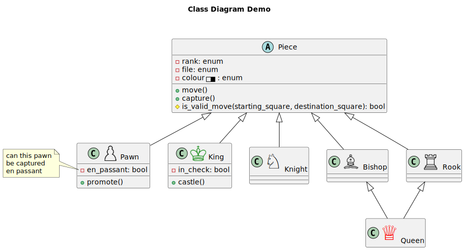
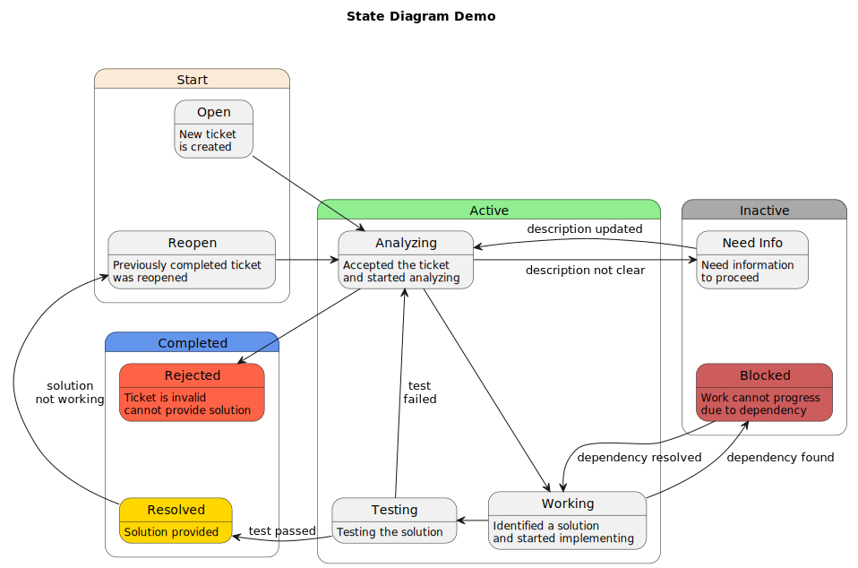
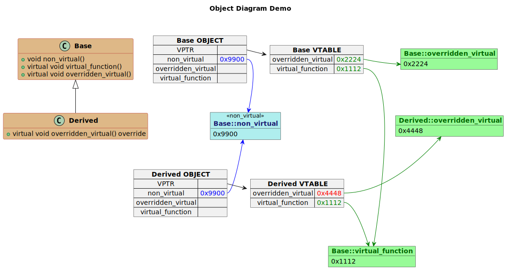
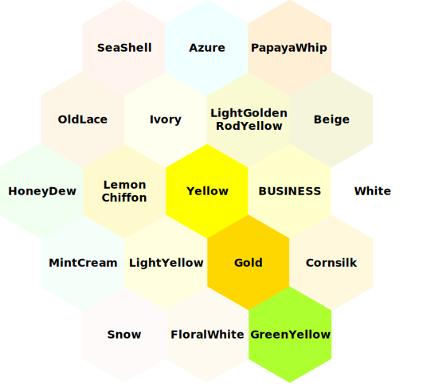
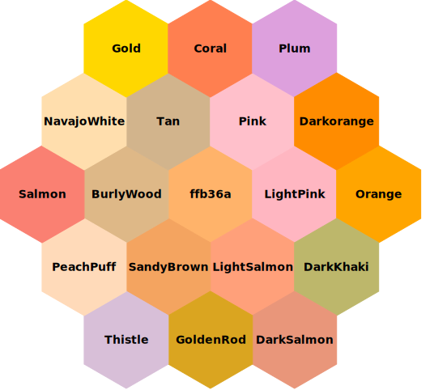
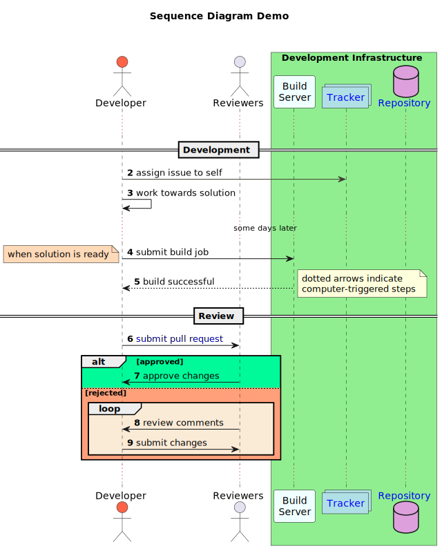
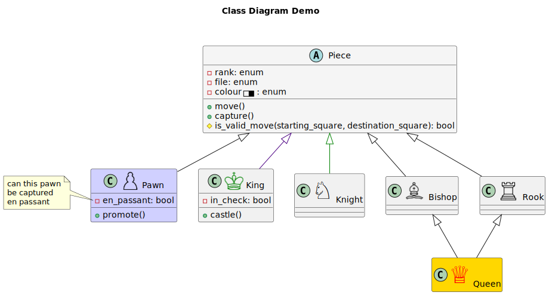
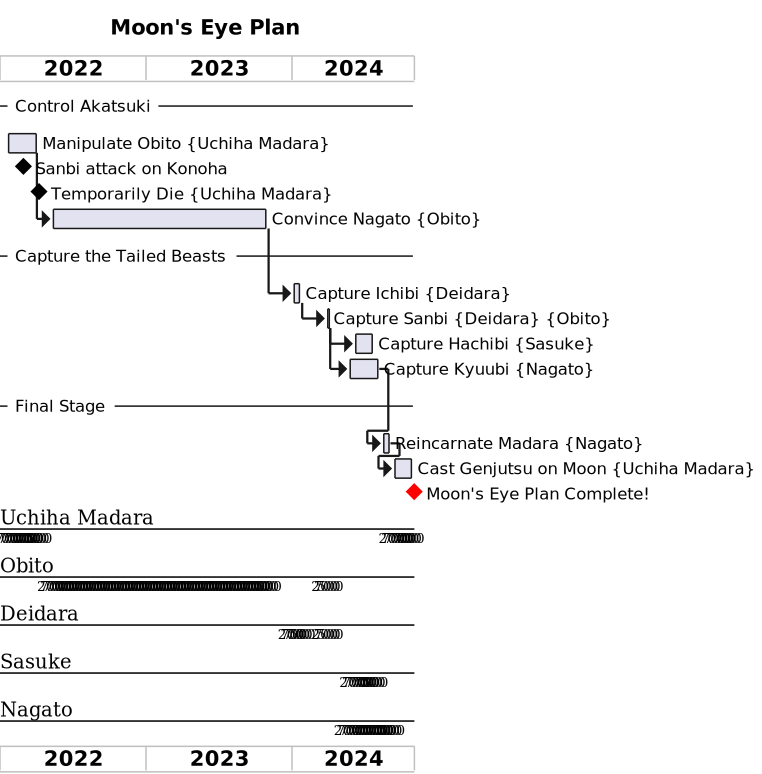
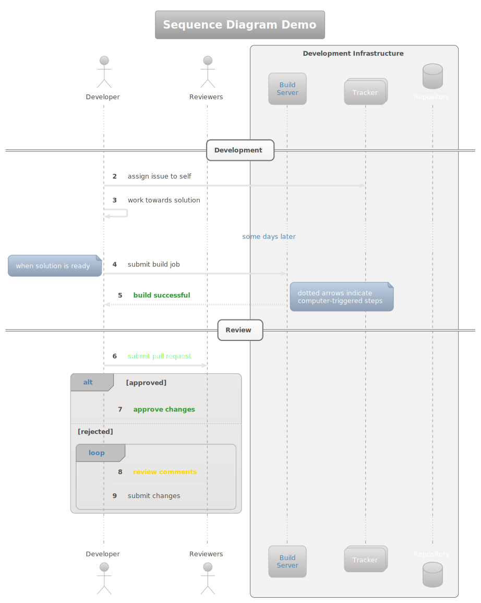

# PlantUML demo ... and other useful stuff

## Data Visualization

PlantUML can _also_ be used to visualize data written in various data representation formats. This document gives a demo of visualization for the following formats:

* YAML: YAML Ain't Markup Language
* JSON: Javascript Object Notation

### YAML Data Visualization

The below demo has the table of contents of this document written in YAML. To create a visual representation with PlantUML, enclose the YAML data within `@startyaml` and `@endyaml`. This YAML data visualization is one of the PlantUML demos, making it an example of self-reference. :grin:

_Note_: PlantUML's YAML support is limited. It doesn't recognize several valid YAML constructs. For example, it considers [YAML's homepage](https://yaml.org/), written in YAML, as invalid YAML.

Refer the [documentation](https://plantuml.com/yaml) for the full set of features and configuration options.

The demo also introduces the following common features:

* Customizing the diagram using `<style>`
* Single line comment using `'`
  * Should be placed on its own separate line, otherwise it is parsed as continuation of the preceding text (unlike `//` comments of C, C++, and Java)
* Multiline comment using `/' ... '/`
  * Can be used anywhere, including on a line having the diagram description
* Use of the lightweight markup language creole

```plantuml
@startyaml
<style>
yamlDiagram {
    node {
        ' use a constant width font because that's what developers do.
        FontName Consolas
        FontSize 20
    }
}
</style>

/'TODO:
It would be cool to hyperlink the entries in the table_of_contents to the
respective section in the document. Not only would it further accentuate the
[Medium Awareness](https://tvtropes.org/pmwiki/pmwiki.php/Main/MediumAwareness)
of this yaml document, but also augment the
[Anachronic Order](https://tvtropes.org/pmwiki/pmwiki.php/Main/AnachronicOrder)
of the outer markdown document.
'/

**table_of_contents**: ""  /' workaround: empty string here to avoid dummy link '/
data_visualization:
    yaml_data : table_of_contents //(this!)//
    json_data : about_me
uml_diagrams:
    - sequence diagram
    - class diagram
    - state diagram
    - timing diagram
    - object diagram
common_features:
    - colours
    - openiconic
    - fonts
    - zoom
    - sprites
preprocessor: ""
non_uml_diagrams:
    - gantt chart
    - mindmap
    - wireframe
general_information:
    - plantuml overview
    - how to run plantuml
    - license information
    - language description
    - syntax checker
    - metadata
    - cypher
    - generating huge diagrams
    - getting help
using_with_other_tools:
    editors:
        - vscode
        - atom
        - eclipse
        - word
    document_generation:
        - doxygen
        - java doclet
        - hpp2plantuml
        - py2puml
    markup_language:
        - markdown
    web_browsers: ""
customization:
    - skinparams
    - themes
    - styles
miscellaneous:
    supporting_plantuml:
        - dedication
        - donation
    plantuml_themes: ""
    uml_for_blind_people: ""
fun_stuff:
    - xearth
    - sudoku
    - oregon trail
@endyaml
```


### JSON Data Visualization

The below demo has some information about me written in JSON. To create a visual representation with PlantUML, enclose the JSON data within `@startjson` and `@endjson`.

Refer the [documentation](https://plantuml.com/json) for the full set of features and configuration options.

```plantuml
@startjson
<style>
jsonDiagram {
    node {
        FontName Segoe Print
        LineColor Brown
        BackgroundColor f8e4d0
    }

    arrow {
        LineColor Brown
    }
}
</style>
{
    "Identity Info": {
        "Name" : {
            "First Name": "Aravind",
            "Last Name": "Pai"
        },
        "Pronouns": "he/his/him"
    },
    "Work History": {
        "Duration": "14 years",
        "Employers": {
            "IBM": "2007–2014",
            "Wipro": "2014-2015",
            "Bosch": "2015–present"
        },
        "Domains": ["VLSI", "EDA", "Navigation", "AD"]
    },
    "Skills Summary": {
        "Roles": [
            "Hardware Verification",
            "Software Development",
            "Applications Engineering"],
        "Languages": ["C++", "C", "Python", "VHDL", "Java", "SQL", "HTML"],
        "Tools": ["Git", "Google Test", "Doxygen", "Conan", "PlantUML"]
    },
    "Interests": ["Animal Care", "Anime/Manga", "Finance", "Reading"],
    "Online Locations": {
        "LinkedIn" : "[[https://www.linkedin.com/in/apai/]]",
        "Telegram" : "[[https://t.me/haoshoku]]",
        "Github" : "[[https://github.com/dragondive]]"
    }
}
@endjson
```


## UML Diagrams

PlantUML draws beautiful UML diagrams from simple textual descriptions. This document gives a demo of the following types of UML diagrams:

* Sequence Diagram
* Class Diagram
* State Diagram
* Timing Diagram
* Object Diagram

### Sequence Diagram

The below sequence diagram describes a workflow of a software developer working on an issue. This demo illustrates a few features:

* A few different participant types
* Encompassing participants in a box
* Autonumbering of steps
* Using divider to split a diagram into logical sections
* Grouping steps
* Delay between steps
* Different arrow types

Refer the [documentation](https://plantuml.com/sequence-diagram) for the full set of features and configuration options.

The demo also introduces the following common features:

* Specifying a title for the diagram
* Defining an object instance using the `as` keyword
* Adding hyperlinks into the diagram
* Placing notes on entities

```plantuml
@startuml
title **Sequence Diagram Demo**\n\n

actor Developer as Dev
actor Reviewers

box Development Infrastructure
    participant "Build\nServer" as Build
    collections "[[https://github.com/dragondive/hebi/issues Tracker]]" as Tracker
    database "[[https://github.com/dragondive/hebi Repository]]" as Repository
end box

autonumber
== Initial Setup ==
Dev -> Repository : clone repository

== Development ==
Dev -> Tracker : assign issue to self
Dev -> Dev : work towards solution

... some days later ...

Dev -> Build : submit build job
note left: when solution is ready

Build --> Dev : build successful
note right: dotted arrows indicate\ncomputer-triggered steps

== Review ==
Dev ->  Reviewers : [[https://github.com/dragondive/hebi/compare submit pull request]]
alt approved
    Reviewers -> Dev : approve changes
else rejected
    loop
        Dev <- Reviewers : review comments
        Dev -> Reviewers : submit changes
    end loop
end alt

== Release ==
Dev -> Build : submit for pre-release check
Build --> Repository : merge changes
note left: build failure scenario\nomitted to reduce clutter.

Repository --> Tracker : close issue
note right: for simplicity, assume\nno merge conflicts.
@enduml
```


### Class Diagram

The below class diagram describes the relationships between the chess piece types. This demo illustrates a few features:

* Defining an abstract class
* Adding methods and attributes to a class
* Describing access specifiers of the class members
* Describing inheritance relationship between classes
* Hiding sections from the class

Refer the [documentation](https://plantuml.com/class-diagram) for the full set of features and configuration options.

The demo also introduces the following common features:

* The preprocessor directive `!include` to include contents of another file
* Defining a sprite and using it in the diagram
* Using unicode characters in the diagram

```plantuml
@startuml
title **Class Diagram Demo**\n\n

!include src/sprites/chess_king.puml /' load sprite from file '/
!include src/sprites/chess_pawn.puml
!include src/sprites/chess_bishop_rook.puml  /' load file having multiple sprites '/

sprite $chess_piece_colour {  /' define sprite directly in the description '/
    FFFFFFFFFFFFFFFFFF
    F00000000FFFFFFFFF
    F00000000FFFFFFFFF
    F00000000FFFFFFFFF
    F00000000FFFFFFFFF
    F00000000FFFFFFFFF
    F00000000FFFFFFFFF
    F00000000FFFFFFFFF
    F00000000FFFFFFFFF
    FFFFFFFFFFFFFFFFFF
}

abstract class Piece {
    - rank: enum
    - file: enum
    - colour <$chess_piece_colour> : enum
    + move()
    + capture()
    # is_valid_move(starting_square, destination_square): bool
}

class "<$pawn,scale=0.4,color=Black> Pawn" as Pawn { /' include the sprite in class name '/
    - en_passant: bool
    + promote()
}

note left of Pawn::en_passant
    can this pawn
    be captured
    en passant
end note

class "<$king,scale=.4,color=green> King" as King { /' change the sprite color '/
    - in_check: bool
    + castle()
}

class "<size:40><color:red>♕</color></size> Queen" as Queen /' use unicode character in class name '/
class "<size:40>&#9816;</size> Knight" as Knight /' use unicode value in class name'/
class "<$bishop,scale=.5,color=Black> Bishop" as Bishop
class "<$rook,scale=.5,color=Black> Rook" as Rook

Piece <|-- Pawn
Piece <|-- Knight
Piece <|-- Bishop
Piece <|-- Rook
Piece <|-- King
Bishop <|-- Queen
Rook <|-- Queen

hide Queen members
@enduml
```


### State Diagram

The below state diagram describes a state transition workflow of an issue tracking systems. This demo illustrates a few features:

* Defining states and substates
* Specifying the state attribute
* Using hidden connectors to guide the diagram layout
* Specifying the state transitions

Refer the [documentation](https://plantuml.com/state-diagram) for the full set of features and configuration options.

```plantuml
@startuml
title **State Diagram Demo**\n\n

state Start #AntiqueWhite {
  state Open
  Open: New ticket \nis created
  state Reopen
  Reopen: Previously completed ticket\nwas reopened
}

state Active #LightGreen {
  state Analyzing
  Analyzing: Accepted the ticket\nand started analyzing
  state Working
  Working: Identified a solution\nand started implementing
  state Testing
  Testing: Testing the solution
}

state Inactive #DarkGray {
  state "Need Info" as Info
  Info: Need information\nto proceed
  state Blocked #IndianRed
  Blocked: Work cannot progress\ndue to dependency
}

state Completed #CornflowerBlue {
  state Resolved #Gold
  Resolved: Solution provided
  state Rejected #Tomato
  Rejected: Ticket is invalid\ncannot provide solution
}

' hidden connectors to "guide" the layout
Open -down[hidden]-> Reopen
Info -down[hidden]-> Blocked
Rejected -down[hidden]-> Resolved
Reopen -down[hidden]-> Rejected

Open -right-> Analyzing

Analyzing -down--> Working
Working -right-> Testing
Testing --> Analyzing: test\nfailed
Testing --> Resolved: test passed

Analyzing -right-> Info: description not clear
Info -left-> Analyzing: description updated
Working -down--> Blocked: dependency found
Blocked ---> Working: dependency resolved

Analyzing --> Rejected
Resolved --> Reopen: solution\nnot working
Reopen --> Analyzing

@enduml
```


### Timing Diagram

The below timing diagram shows a hypothetical data transfer protocol. This demo illustrates a few features:

* Declaring various types of elements in a timing diagram
* Specifying transitions as either time-oriented or participant-oriented
* Displaying time constraints
* Highlighting a region of the diagram

Refer the [documentation](https://plantuml.com/timing-diagram) for the full set of features and configuration options.

```plantuml
@startuml
title **Timing Diagram Demo**\n\n

clock clk with period 1
binary "Address Enable" as ADDR_EN
concise "Address" as ADDR
binary "Data Enable" as DATA_EN
concise "Data" as DATA
binary "Read/Write" as RW

@ADDR_EN
0 is low
2 is high
8 is low

@0
ADDR is {-}
DATA_EN is low
DATA is {-}

@1
ADDR is "VALID ADDRESS"

@2
DATA is "VALID DATA"
RW is high

@3
DATA_EN is high

@7
DATA_EN is low
RW is low

@8
DATA is {-}

@9
ADDR is {-}

DATA_EN@3 <-> @7 : {>=4 cycles}
highlight 2 to 8 #technology;line:DimGrey : Data transfer region

@enduml
```


### Object Diagram

The below object diagram illustrates a common implementation of virtual functions in C++. This demo illustrates a few features:

* Declaring object type and map type
* Adding link from a map field to an object
* Specifying fields in an object
* Using divider to split a diagram into logical sections
* Specifying direction for arrow connectors
* Using hidden connectors to guide the diagram layout
* Using class diagram and object diagram together

Refer the [documentation](https://plantuml.com/object-diagram) for the full set of features and configuration options.

```plantuml
@startuml
<style>
classDiagram {
    class {
        BackgroundColor BurlyWood
        LineColor FireBrick

        header {
            FontStyle Bold
        }
    }
}

object {
    BackgroundColor PaleGreen

    header {
        FontColor DarkGreen
        FontStyle Bold
    }
}

.non_virtual {
    BackgroundColor PaleTurquoise

    header {
        FontColor MidnightBlue
        FontStyle Bold
    }
}
</style>

title **Object Diagram Demo**\n\n

class Base {
    + void non_virtual()
    + virtual void virtual_function()
    + virtual void overridden_virtual()
}

class Derived {
    + virtual void overridden_virtual() override
}
Base <|== Derived
hide class fields

map "**Base OBJECT**" as BO {
    VPTR=>
    non_virtual=><color:Blue>0x9900</color>
    overridden_virtual=>
    virtual_function=>
}

map "**Derived OBJECT**" as DO {
    VPTR=>
    non_virtual=><color:Blue>0x9900</color>
    overridden_virtual=>
    virtual_function=>
}

map "**Derived VTABLE**" as DV {
    overridden_virtual => <color:Red>0x4448</color>
    virtual_function => <color:Green>0x1112</color>
}

map "**Base VTABLE**" as BV {
    overridden_virtual => <color:Green>0x2224</color>
    virtual_function => <color:Green>0x1112</color>
}

' bug: both custom style and stereotype are applied as they have the same syntax
' see: https://forum.plantuml.net/14692/user-defined-style-applied-on-class-also-becomes-stereotype
object "Base::non_virtual" as non_virtual <<non_virtual>> {
    0x9900
}

object "Base::virtual_function" as base_virtual {
    0x1112
}

object "Base::overridden_virtual" as overridden_virtual {
    0x2224
}

object "Derived::overridden_virtual" as derived_overridden_virtual {
    0x4448
}

BO::non_virtual -[#Blue]> non_virtual
DO::non_virtual -up[#Blue]> non_virtual

BO::VPTR -right-> BV
DO::VPTR -right-> DV

BV::virtual_function -[#Green]> base_virtual
BV::overridden_virtual -right[#Green]> overridden_virtual

DV::virtual_function -[#Green]-> base_virtual
DV::overridden_virtual -up[#Green]> derived_overridden_virtual

' hidden connectors to "guide" the layout
Base -right[hidden]> BO
BO -down[hidden]--> DO
BV -down[hidden]--> DV
base_virtual -[hidden]down-> derived_overridden_virtual
BV -down[hidden]-> non_virtual
non_virtual -down[hidden]-> DV
overridden_virtual -down[hidden]-> derived_overridden_virtual

@enduml
```


## Common Features

This section includes demo of the common features that apply to all or multiple diagram types:

* Colours
* OpenIconic
* Fonts
* Zoom
* Sprites

### Colours

The colour can be configured for almost all the entities that appear in PlantUML diagrams. The colour can be specified by its hexadecimal RGB value.

#### Named Colours

PlantUML also defines names for some common colours. These names can be also be used to specify the colour. The `colors` command prints the palette of all the named colours.

```plantuml
@startuml
colors
@enduml
```


#### Similar Colours

The `colors` command can also be called with an argument, which is either a named colour or a hexadecimal RGB colour value. It prints the palette of named colours similar to the specified colour.

```plantuml
@startuml
colors Yellow
@enduml
```


```plantuml
@startuml
colors #ffb36a
@enduml
```


#### Demo

This demo shows the use of various colours in a sequence diagram and a class diagram.

```plantuml
@startuml
title **Sequence Diagram Demo**\n\n

actor Developer as Dev  #Tomato
actor Reviewers

box Development Infrastructure #LightGreen
    participant "Build\nServer" as Build #Azure
    collections "[[https://github.com/dragondive/hebi/issues Tracker]]" as Tracker #PowderBlue
    database "[[https://github.com/dragondive/hebi Repository]]" as Repository #Plum
end box

autonumber 2
...
== Development ==
Dev -[#404032]> Tracker : assign issue to self
Dev -> Dev : work towards solution

... some days later ...
Dev -> Build : submit build job
note left #PeachPuff : when solution is ready
Build --> Dev : build successful
note right: dotted arrows indicate\ncomputer-triggered steps

== Review ==
Dev ->  Reviewers : [[https://github.com/dragondive/hebi/compare submit pull request]]
alt #MediumSpringGreen approved
    Reviewers -> Dev : approve changes
else #LightSalmon rejected
    loop #AntiqueWhite
        Dev <- Reviewers : review comments
        Dev -> Reviewers : submit changes
    end loop
end alt
...

@enduml
```


<br><br>

```plantuml
@startuml
title **Class Diagram Demo**\n\n
!include src/sprites/chess_king.puml /' load sprite from file '/
!include src/sprites/chess_pawn.puml
!include src/sprites/chess_bishop_rook.puml  /' load file having multiple sprites '/

sprite $chess_piece_colour {  /' define sprite directly in the description '/
    FFFFFFFFFFFFFFFFFF
    F00000000FFFFFFFFF
    F00000000FFFFFFFFF
    F00000000FFFFFFFFF
    F00000000FFFFFFFFF
    F00000000FFFFFFFFF
    F00000000FFFFFFFFF
    F00000000FFFFFFFFF
    F00000000FFFFFFFFF
    FFFFFFFFFFFFFFFFFF
}

abstract class Piece #WhiteSmoke {
    - rank: enum
    - file: enum
    - colour <$chess_piece_colour> : enum
    + move()
    + capture()
    # is_valid_move(starting_square, destination_square): bool
}

class "<$pawn,scale=0.4,color=Black> Pawn" as Pawn #D0D0FF { /' include the sprite in class name '/
    - en_passant: bool
    + promote()
}

note left of Pawn::en_passant
    can this pawn
    be captured
    en passant
end note

class "<$king,scale=.4,color=green> King" as King { /' change the sprite color '/
    - in_check: bool
    + castle()
}

class "<size:40><color:red>♕</color></size> Queen" as Queen #Gold /' use unicode character in class name '/
class "<size:40>&#9816;</size> Knight" as Knight /' use unicode value in class name'/
class "<$bishop,scale=.5,color=Black> Bishop" as Bishop
class "<$rook,scale=.5,color=Black> Rook" as Rook

Piece <|-- Pawn
Piece <|-[#Green]- Knight
Piece <|-- Bishop
Piece <|-- Rook
Piece <|-[#Indigo]- King
Bishop <|-- Queen
Rook <|-- Queen

hide Queen members
@enduml
```


### OpenIconic

The open source icon set OpenIconic can be used in diagrams using the syntax `<&icon_name>`. The `listopeniconic` command lists the available icons.

```plantuml
@startuml
listopeniconic
@enduml
```


#### Demo

```plantuml
@startuml

rectangle "<size:32>**Developers <&monitor><&tablet><&phone> of the world <&globe>, unite! <&people><&people>**</size>"
@enduml
```


### Fonts

The font can be configured for almost all the text that appears in PlantUML diagrams. The `listfonts` command lists all the fonts available on the system.

```plantuml
@startuml
listfonts
@enduml
```


#### Demo

This demo shows the customization of font used in a sequence diagram.

The demo also introduces the following common features:

* Customizing the diagram using the `skinparam` command

```plantuml
@startuml
skinparam DefaultFontName Courier New
skinparam DefaultFontSize 16
"Brian Kernighan" -> Developers : main( ) {\n        printf(“hello, world”);\n}
note right : [[https://ozanerhansha.medium.com/on-the-origin-of-hello-world-61bfe98196d5 On the Origin of "Hello, World!"]]
@enduml
```


### Zoom

The generated image can be zoomed in or out by specifying a scaling factor.

This demo shows the use of `scale` command to enlarge the image.

The demo also introduces the following common features:

* PlantUML's preprocessor functionalities

```plantuml
@startuml
/' computes the factorial of the given integer. '/
!function $factorial($n)
    /' Return value of this function is memoized because it uses recursion.
    PlantUML preprocessor doesn't provide dictionary or array data structure,
    hence a "hack" simulates a dictionary. For every input integer, a variable
    is created with the stringized integer as its name, and the return value is
    assigned to it. Thus, the variable's name serves as the "key". '/
    !if %variable_exists(%string($n))
        !return %get_variable_value(%string($n))
    !endif

    !if $n == 0
        !$value = 1
    !else
        !$value = $n * $factorial($n - 1)
    !endif

    %set_variable_value(%string($n), $value)
    !return $value
!endfunction

!procedure $factorial_question_answer_sequence(\
        $starting_number = 0,\
        $ending_number = 12,\
        $color_number_in_question = blue,\
        $color_number_in_answer = green)
    skinparam SequenceMessageAlignment direction
    !$number = $starting_number
    !while $number <= $ending_number
        Question -> Answer : What is factorial of <color:$color_number_in_question>**$number**</color>?
        Question <- Answer : Factorial of <color:$color_number_in_question>**$number**</color> is <color:$color_number_in_answer>**$factorial($number)**</color>.
        |||
        !$number = $number + 1
    !endwhile
!endprocedure

scale 1.5 /' zooms the generated diagram per specified scaling factor '/
$factorial_question_answer_sequence(\
    $color_number_in_answer = darkviolet, $color_number_in_question = red\
)
@enduml
```


### Sprites

Small graphical elements known as sprites can be used in diagrams.

* **Encoding an image into sprite**: Any image can be encoded into a sprite using a command like below:

  ```
  java -jar plantuml.jar -encodesprite 16z <image>
  ```

* **Including sprites into diagrams**: The encoded sprite can be included either inline or as a file through `!include` directive.

* **PlantUML StdLib**: PlantUML includes a huge collection of sprites in its standard library. Refer the [documentation](https://plantuml.com/sprite) for further information.

#### Demo

```plantuml
@startuml
<style>
classDiagram {
    class {
        LineColor Black
        BackGroundColor LemonChiffon
        FontSize 40
        FontStyle Bold
    }
}
rectangle {
    FontSize 40
    FontStyle Bold
    HorizontalAlignment Center
    LineColor Black
    BackGroundColor White
}
</style>

!include src/sprites/batman.puml

rectangle "<$batman>\n\
KEEP\n\
CALM\n\
AND\n\
CALL\n\
BATMAN"
@enduml
```


## Preprocessor

PlantUML includes a preprocessor. It can be used as a higher level abstraction to generate the diagram description. It also serves as a mini programming language to generate the diagrams programatically. The PlantUML preprocessor is similar to the C preprocessor, with one main difference being that it uses `!` character instead of `#` for preprocessor directives.

The PlantUML preprocessor provides variables, conditional expressions (with `!if`, `!else`, `!elseif` and `!endif`), looping (with `!while` and `!endwhile`), procedures (with `!procedure` and `!endprocedure`) and functions (with `!function`, `!endfunction` and `!return`). It also provides some builtin functions for convenient use in the preprocessor code.

Refer the [documentation](https://plantuml.com/preprocessor) for the syntax rules, full set of features and builtin functions.

Several preprocessor code examples are available in [src/preprocessor](src/preprocessor) and some of them are described briefly here. All these examples are my original work. I created some of them initially to self-learn the preprocessor, but ended up having too much fun and created more preprocessor codes mainly for enjoyment. :satisfied:

* **[fibonacci_recursive_in_out_with_user_function_demo.puml](src/preprocessor/fibonacci_recursive_in_out_with_user_function_demo.puml)**: Generates the fibonacci recursion tree in the form of a state diagram. It also demonstrates simple customization based on conditional expressions in two ways: using a user-defined function, and using a lambda expression.
* **[fibonacci_memoized_demo.puml](src/preprocessor/fibonacci_memoized_demo.puml)**: Generates the graph of the memoized approach for the computation of fibonacci number.
* **[factorial_question_answer_sequence.puml](src/preprocessor/factorial_question_answer_sequence.puml)**: Generates a question and answer series as a sequence diagram. The questions in the series consist of asking the factorial of a sequence of numbers, while the answer provides the requested factorial.
* **[full_binary_tree_demo.puml](src/preprocessor/full_binary_tree_demo.puml)**: Generates the full binary tree for the specified height in the form of an object diagram.
* **[test_match_host_wbs_demo.puml](src/preprocessor/test_match_host_wbs_demo.puml)**: Reads a JSON file that contains data of Test cricket matches hosted in the form of a recursive data structure. Generates a Work Breakdown Structure (WBS) diagram, while summing up the counts at every level.
* **[factorial_demo_test.puml](src/preprocessor/factorial_demo_test.puml)**: Uses the `!assert` directive to define "unit tests" for the factorial computation PlantUML code. :sunglasses:
* **[collatz_sequence.puml](src/preprocessor/collatz_sequence.puml)**: Generates the [collatz sequence](https://en.wikipedia.org/wiki/Collatz_conjecture) for a series of numbers, with a separate image for the diagram of each number.
* **[multiple_diagrams_generation_demo.puml](src/preprocessor/multiple_diagrams_generation_demo.puml)**: Demonstrates generation of multiple diagrams from a single diagram description. The preprocessor code provides the overall structure for the diagrams, while a JSON file can configure various portions of the diagrams generated.

## Non-UML Diagrams

PlantUML can also draw several types of non-UML diagrams from simple textual descriptions. This document gives a demo of the following types of non-UML diagrams:

* Gantt Chart
* Mindmap
* Wireframe

### Gantt Chart

The below gantt chart illustrates the schedule of a fictional project. This demo illustrates a few features:

* Declaring tasks on the chart
* Specifying start date for task
* Specifying task duration
* Separating tasks into logical sections
* Showing milestones on the chart
* Assigning workers to tasks
* Indicating constraints between tasks or milestones

Refer the [documentation](https://plantuml.com/gantt-diagram) for the full set of features and configuration options.

```plantuml
@startgantt
printscale yearly
scale 1.5

title Moon's Eye Plan
project starts on 2022-01-01
-- Control Akatsuki --
[Manipulate Obito] as [Obito] on {Uchiha Madara} starts at 2022-01-15
[Obito] lasts 12 weeks

[Sanbi attack on Konoha] happens at 2022-02-28
[Temporarily Die] on {Uchiha Madara} happens at [Obito]'s end

[Convince Nagato] as [Nagato] on {Obito} lasts 78 weeks
[Nagato] starts 4 weeks after [Obito]'s end

-- Capture the Tailed Beasts --
[Capture Ichibi] as [Ichibi] on {Deidara} lasts 4 weeks
[Ichibi] starts 8 weeks after [Nagato]'s end

[Capture Sanbi] as [Sanbi] on {Deidara} {Obito} lasts 4 weeks
[Sanbi] starts 8 weeks after [Ichibi]'s end

[Capture Hachibi] as [Hachibi] on {Sasuke} lasts 8 weeks
[Hachibi] starts 8 weeks after [Sanbi]'s end

[Capture Kyuubi] as [Kyuubi] on {Nagato} lasts 12 weeks
[Kyuubi] starts 6 weeks after [Sanbi]'s end

-- Final Stage --
[Reincarnate Madara] as [Re] on {Nagato} lasts 4 weeks
[Re] starts after [Kyuubi]'s end
[Cast Genjutsu on Moon] as [Genjutsu] on {Uchiha Madara} lasts 8 weeks
[Genjutsu] starts at [Re]'s end
[Moon's Eye Plan Complete!] as [Complete] happens at [Genjutsu]'s end
[Complete] is colored in Red

@endgantt
```


### Mindmap

The below mindmap illustrates some investment options available in India. This demo illustrates a few features:

* Adding items to the mindmap heirarchically
* Splitting the mindmap into left side and right side
* Applying styles to various parts of the diagram

Refer the [documentation](https://plantuml.com/mindmap-diagram) for the full set of features and configuration options.

```plantuml
@startmindmap
<style>
    mindmapDiagram {
        node {
            BackgroundColor PaleGreen
            FontColor Black
            LineColor DarkGreen
        }

        rootNode {
            BackgroundColor DodgerBlue
            FontColor White
            FontStyle Bold
            LineColor DarkBlue
        }

        :depth(1) {
            BackgroundColor LightSalmon
        }

        arrow {
            LineColor Brown
        }
    }
</style>
title <size:24>Investment Options in India</size>

* Investments
** Equity
*** Stocks
*** Equity ETF
*** Equity Mutual Funds
** Debt
*** Debt Mutual Funds
*** Government Bonds
*** Fixed Deposits

left side
** Assets
*** Real Estate
*** Commodities
**** Gold
**** Silver
**** Crude Oil
** Retirals
*** Public Provident Fund
*** National Pension System
@endmindmap
```


### Wireframe

The below wireframe illustrates the user interface of a social media site. This demo illustrates a few features:

* Use of a few standard UI elements, such as buttons, dropdown
* Organizing the UI elements using table
* Formatting the text elements using Creole markup

Refer the [documentation](https://plantuml.com/salt) for the full set of features and configuration options.

```plantuml
@startsalt
scale 1.5
skinparam padding 10

{+
    {
        <size:20>**<&script> Storybook**</size>
    }
    {
        {
            What is your story? <&fullscreen-enter>
            .
            .
            .
        } | . |
        {
            <size:16>**Popular Storytellers**</size>
            .
            <&person> **Rahul Dravid** [<&script> 164 stories]
            <&person> **Bill Watterson** [<&script> 3160 stories]
            .
            .
        }
        {
            [<&circle-check> Post] | [<&paperclip>Attach...]
        }
    }
    {
        <size:16>**Trending Stories <&bolt>**</size> | ^Today^
        .
        {
            **Compassion Unlimited Plus Action (CUPA)** <&heart>2.5M
            Be a part of our community,
            Give the animals some of your time. <i>continue reading ...</i>
        }
        {
            .
            **Elon Musk** <&heart>1.6M
            Forget spaceships, we should teleport to Mars by 2030,
            because ... why not? <i>continue reading ...</i>
        }
    }
}
@endsalt
```


## General Information

### PlantUML Overview

As a text-based drawing tool, PlantUML offers the following benefits over a GUI-based tool:

* **Convenience**: Writing the diagram description is often more convenient than dragging items on a canvas from a GUI toolbox.
* **Revision control**: Diagram descriptions are saved in text files which are well suited for use with revision control systems as compared to images.
* **Easier reviews**: diff tools make it easy to identify changes to the diagram, which make reviews easier. Any deviations between the source code and the diagrams describing them are more likely to be identified and fixed during the code reviews, making the documentation more reliable.
* **Continuous integration for documentation**: Diagrams are frequently an indespensible component of good documentations. Continuous integration systems can be configured to automatically generate and update the diagrams.
* **Uniform and standardized diagrams**: Generated diagrams are more uniform and standardized which reduces hurdles in understanding and discussing them.

Text-based drawing tools, such as PlantUML, are an important enabler for the [docs-as-code](https://www.writethedocs.org/guide/docs-as-code/) approach.

**What PlantUML cannot do**: PlantUML is not a [golden hammer](https://en.wikipedia.org/wiki/Law_of_the_instrument) for all documentation needs. It serves reasonably well for lightweight architectures and for diagrams of simple to moderate complexity.

For more complex modelling requirements of bigger software systems, PlantUML alone is not sufficient. This especially holds when we need to reuse the models to provide different views of the system. PlantUML is an important tool in the developer's documentation toolbox but it is often best used in symphony with other tools.

### How to run PlantUML

There are several ways to run PlantUML. The most commonly used ways are:

* **From the command line**: Download the latest precompiled binary `plantuml.jar` from the [download page](https://plantuml.com/download). Execute it from the command line. Provide the text files or directory containing the diagram descriptions as arguments. (requires [Java](https://www.java.com/en/download/) and [Graphviz](https://graphviz.org/download/))

    ```
    java -jar plantuml.jar file1 file2 file3
    ```

    Refer the [documentation](https://plantuml.com/command-line) for the full set of features and configuration options.

* **As a standalone GUI**: PlantUML can be run as a standalone GUI application, either by double clicking the `plantuml.jar` or using the following command:

    ```
    java -jar plantuml.jar -gui
    ```

    Then the file or directory containing the diagram descriptions can be selected from the GUI to generate the diagrams.

* **As a web service**: PlantUML can be hosted as a web service, which is then used to generate the diagrams. There are three approaches available to use the web service:
    1. Enter the diagram description into the text box on the web page.
    2. Encode the diagram description into a string, using the command line option `-encodeurl`. Use it with the web service corresponding to the image type to obtain the diagram.
    3. Enter the encoded URL into the web browser which displays the diagram.

    The web service can be used in the following ways:
  * **On the PlantUML server**: PlantUML hosts the web service at <http://www.plantuml.com/plantuml/>
  * **Locally as a docker container**: PlantUML web service can be hosted locally using the official docker image, with the following commands:

      ```
      docker pull plantuml/plantuml-server
      docker run -d -p 8080:8080 plantuml/plantuml-server
      ```

      It hosts the plantuml server locally on `http://localhost:8080`.

    Refer the [documentation](https://plantuml.com/server) for the full set of features and configuration options.

#### Demo

The [attached video](videos/plantuml_docker_demo.mp4) shows a demo of generating a PlantUML diagram using the docker container approach. The python module `plantuml` is a remote client interface that encodes the diagram description and communicates with the specified server.

### License Information

PlantUML is licensed under the GPL license. It is also available under other licenses (LGPL, Apache, Eclipse Public, MIT) with some missing features. The generated images are owned by the author of the diagram description.

The special command `license` prints the license text.

```plantuml
@startuml
license
@enduml
```


### Language Description

The command line option `-language` prints to standard output a description of the PlantUML language.

### Syntax Checker

The command line option `-syntax` checks the syntax of the diagram description from the standard input, and reports any syntax errors without generating the diagram.

### Metadata

PlantUML stores the diagram description into the generated image as metadata, in the form of encoded text. The command line option `-metadata` recovers it from the generated image.

### Cypher

The command line option `-cypher` replaces all words, except PlantUML keywords, with random letters. This is useful while reporting issues when the diagram description contains confidential data.

### Generating Huge Diagrams

PlantUML restricts image width and height to 4096 pixels by default. This can be overridden by setting the environment variable `PLANTUML_LIMIT_SIZE`.

### Getting Help

Questions not answered from the documentation can be asked either on the [PlantUML forum](https://forum.plantuml.net/) or on [PlantUML's github page](https://github.com/plantuml/plantuml/issues). PlantUML's source code is available on [github](https://github.com/plantuml).

## Using with other tools

PlantUML can be used together with several tools. This document describes use of PlantUML with the following tools:

* Editors
  * VSCode
  * Atom
  * Eclipse
  * Word
* Document Generation
  * Doxygen
  * Java Doclet
  * hpp2plantuml
  * py2puml
* Markup Languages
  * markdown
* Browsers

### Editors

#### VSCode

* **Preview PlantUML diagrams directly**: PlantUML plugins enable generating a preview of the plantuml diagram descriptions directly from VSCode.
* **Preview PlantUML diagrams included in markdown**: PlantUML diagram descriptions can also be included inside markdown code. Markdown plugins enable generating the diagram preview inline within the markdown preview.

The [attached video](videos/plantuml_vscode_demo.mp4) shows a demo of both the options.

#### Atom

Atom editor has plugins to preview the PlantUML diagram descriptions, for both standalone files and when included in a markdown file.

The [attached video](videos/plantuml_atom_demo.mp4) shows a demo of both the options.

#### Eclipse

PlantUML plugins are also available for the Eclipse IDE which enable generating a preview of the diagrams.

#### Word

PlantUML addin for Microsoft Word generates the diagrams for the plantuml diagram description and includes them directly into the same document.

The [attached video](videos/plantuml_word_demo.mp4) shows a demo of using this addin.

### Document Generation

#### Integration with Doxygen

PlantUML diagrams can be embedded directly into the doxygen documents. PlantUML diagram description enclosed within the doxygen commands `\startuml` and `\enduml` appears inline in the generated document.

The [attached video](videos/plantuml_doxygen_demo.mp4) shows a demo using my [conan_learning](https://github.com/dragondive/conan_learning) project.

#### Java Doclet

`uml-java-doclet` plugin can generate class diagrams from the Java code and embed them into the javadoc. The [documentation](https://plantuml.com/doclet) describes how to obtain this plugin. The [attached video](videos/plantuml_java_doclet_demo.mp4) shows a demo of using this plugin to generate the class diagrams for PlantUML's own source code.

#### hpp2plantuml

Python module `hpp2plantuml` available [here](https://pypi.org/project/hpp2plantuml/) on PyPI can generate class diagrams from C++ code. The [attached video](videos/plantuml_hpp2plantuml_demo.mp4) shows a demo of using this module to generate class diagrams for VLC media player's source code.

#### py2puml

Python utility `py2puml` available [here](https://github.com/deadbok/py-puml-tools) on github can generate class diagrams from Python code. The [attached video](videos/plantuml_py2puml_demo.mp4) shows a demo of using this module to generate class diagrams for my ongoing hobby project [multibeggar](https://github.com/dragondive/hebi/tree/main/multibeggar).

### Markup Languages

#### markdown

Python module `plantuml-markdown` available [here](https://pypi.org/project/plantuml-markdown/) on PyPI can generate HTML page from a markdown file that has plantuml source code included. The [attached video](videos/plantuml_markdown_py_demo.mp4) shows a demo of using this module to generate the HTML for this document itself, making it another example of self-reference. :grin:

### Web Browsers

Browser extensions are available to render PlantUML in the Chrome and Firefox web browsers. The [attached video](videos/plantuml_browsers_demo.mp4) shows a demo of using these plugins.

## Customization

PlantUML provides a number of features for customizing the look and feel of the diagrams. This section provides a demo of the following customization features:

* Skinparams
* Themes
* Styles

### Skinparams

The colors and fonts of the diagram can be changed by specifying one or more `skinparam` declarations in the diagram description, with the following syntax:

```
skinparam <parameter> <value>
```

#### Demos

* **black and white diagram**: The skinparam `monochrome` is used to make a black and white diagram.

```plantuml
@startuml
skinparam monochrome true
skinparam DefaultFontName Courier New
skinparam DefaultFontSize 16
"Brian Kernighan" -> Developers : main( ) {\n        printf(“hello, world”);\n}
note right : [[https://ozanerhansha.medium.com/on-the-origin-of-hello-world-61bfe98196d5 On the Origin of "Hello, World!"]]
@enduml
```


* **handwritten diagram**: The skinparam `handwritten` is used to give a hand-drawn appearance to the diagram.

```plantuml
@startuml
skinparam handwritten true
skinparam DefaultFontName Courier New
skinparam DefaultFontSize 16
"Brian Kernighan" -> Developers : main( ) {\n        printf(“hello, world”);\n}
note right : [[https://ozanerhansha.medium.com/on-the-origin-of-hello-world-61bfe98196d5 On the Origin of "Hello, World!"]]
@enduml
```


* **dark mode diagram**: The skinparam `monochrome` set to `reverse` generates a dark mode diagram, suitable for placing the diagram on a black background.

```plantuml
@startuml
skinparam monochrome reverse
skinparam DefaultFontName Courier New
skinparam DefaultFontSize 16
"Brian Kernighan" -> Developers : main( ) {\n        printf(“hello, world”);\n}
note right : [[https://ozanerhansha.medium.com/on-the-origin-of-hello-world-61bfe98196d5 On the Origin of "Hello, World!"]]
@enduml
```


* **customize individual entities**: Skinparam can be used not only to customize the overall look and feel of the diagram, but also of individual entities in the diagram. The below demo shows customization of the participants and the note.

```plantuml
@startuml
skinparam DefaultFontName Courier New
skinparam DefaultFontSize 16

skinparam Participant {
    BackgroundColor LightSkyBlue
    BorderColor Blue
    FontStyle Bold
}

skinparam BackgroundColor PapayaWhip

skinparam NoteBackgroundColor Bisque
skinparam NoteBorderColor Brown
skinparam NoteBorderThickness 2

skinparam SequenceLifeLineColor Red

"Brian Kernighan" -> Developers : main( ) {\n        printf(“hello, world”);\n}
note right : [[https://ozanerhansha.medium.com/on-the-origin-of-hello-world-61bfe98196d5 On the Origin of "Hello, World!"]]
@enduml
```


#### List of all skinparams

The command `skinparameters` can be used to generate a diagram with a list of all the available skinparams. This list can also be generated by executing PlantUML on the command line with the `-language` option.

```console
skinparameters
```

### Themes

Themes can be applied to the PlantUML diagrams. The command `help themes` lists the themes available in the core library. Some themes include procedures to colour messages.

```plantuml
@startuml
help themes
@enduml
```

#### Demo

```plantuml
@startuml
!theme metal
title **Sequence Diagram Demo**

actor Developer as Dev
actor Reviewers

box Development Infrastructure
    participant "Build\nServer" as Build
    collections "[[https://github.com/dragondive/hebi/issues Tracker]]" as Tracker
    database "[[https://github.com/dragondive/hebi Repository]]" as Repository
end box

autonumber 2
...
== Development ==
Dev -> Tracker : assign issue to self
Dev -> Dev : work towards solution

... some days later ...
Dev -> Build : submit build job
note left : when solution is ready
Build --> Dev : $success("build successful")
note right: dotted arrows indicate\ncomputer-triggered steps

== Review ==
Dev ->  Reviewers : [[https://github.com/dragondive/hebi/compare submit pull request]]
alt approved
    Reviewers -> Dev : $success("approve changes")
else rejected
    loop
        Dev <- Reviewers : $warning("review comments")
        Dev -> Reviewers : submit changes
    end loop
end alt
...

@enduml
```


### Styles

CSS-like styles can be applied to the diagrams. The stylesheet can be either included inline in the diagram description between `<style>` and `</style>` tags, or included from a separate file.

#### Demo

```plantuml
@startuml
<style>
    classDiagram {
        class {
            BackGroundColor PowderBlue
            LineColor CornflowerBlue
        }

        arrow {
            LineColor Tomato
        }

        .major_piece {
            FontStyle bold
            BackGroundColor Yellow
        }
    }
</style>
title **Class Diagram Demo**\n\n

!include src/sprites/chess_king.puml /' load sprite from file '/
!include src/sprites/chess_pawn.puml
!include src/sprites/chess_bishop_rook.puml  /' load file having multiple sprites '/

sprite $chess_piece_colour {  /' define sprite directly in the description '/
    FFFFFFFFFFFFFFFFFF
    F00000000FFFFFFFFF
    F00000000FFFFFFFFF
    F00000000FFFFFFFFF
    F00000000FFFFFFFFF
    F00000000FFFFFFFFF
    F00000000FFFFFFFFF
    F00000000FFFFFFFFF
    F00000000FFFFFFFFF
    FFFFFFFFFFFFFFFFFF
}

abstract class Piece {
    - rank: enum
    - file: enum
    - colour <$chess_piece_colour> : enum
    + move()
    + capture()
    # is_valid_move(starting_square, destination_square): bool
}

class "<$pawn,scale=0.4,color=Black> Pawn" as Pawn { /' include the sprite in class name '/
    - en_passant: bool
    + promote()
}

note left of Pawn::en_passant
    can this pawn
    be captured
    en passant
end note

class "<$king,scale=.4,color=green> King" as King { /' change the sprite color '/
    - in_check: bool
    + castle()
}

class "<size:40><color:red>♕</color></size> Queen" as Queen <<major_piece>> /' use unicode character in class name '/
class "<size:40>&#9816;</size> Knight" as Knight /' use unicode value in class name'/
class "<$bishop,scale=.5,color=Black> Bishop" as Bishop
class "<$rook,scale=.5,color=Black> Rook" as Rook <<major_piece>>

Piece <|-- Pawn
Piece <|-- Knight
Piece <|-- Bishop
Piece <|-- Rook
Piece <|-- King
Bishop <|-- Queen
Rook <|-- Queen

hide Queen members
@enduml
```


## Miscellaneous

### Supporting PlantUML

There are a number of options available to support the PlantUML tool:

* Dedication
* Donation

#### Dedication

Dedicate a picture or a photo with a message, which will be integrated into the PlantUML code. To support this service, a contribution of $5 per month is recommended.

The dedication can be public or private. It will be available in each and every deployed instance of PlantUML across the world!

```plantuml
@startuml
Write your own dedication!
@enduml
```


The currently added public dedications can be seen directly from the source code: <https://github.com/plantuml/plantuml/blob/master/src/net/sourceforge/plantuml/dedication/Dedications.java>

#### Donation

To support PlantUML via crowdfunding, donate using [Paypal](http://plantuml.com/paypal), [Patreon](http://plantuml.com/patreon) or [Liberapay](http://plantuml.com/lp). The special `donors` command prints the list of donors and sponsors.

### PlantUML Themes

Some user-contributed PlantUML themes are available at [Puml Themes](https://bschwarz.github.io/puml-themes/) and [RedDress-PlantUML](https://github.com/Drakemor/RedDress-PlantUML)

### UML for Blind People

[This web page](http://www.bfg-it.de/wiki/Blind_mit_UML_arbeiten) describes PlantUML as part of a solution to describe UML to blind people. (The page is written in German, and can be translated to English or other languages using a language translation engine.)

## Fun Stuff

PlantUML comes with some fun stuff. This document gives a demo of the following fun stuff:

* xearth
* sudoku
* oregon trail

### xearth

This demo shows the use of `xearth` command to draw a map of the Earth focussed on a specified coordinate.

Refer the [documentation](https://plantuml.com/xearth) for the full set of features and configuration options.

```plantuml
@startuml
xearth(800,800)     /' define the image dimensions for the earth image. '/
viewPositionType = Fixed
viewPosLat = 12.971563711294497    /' ಬ್ರಿಗೇಡ್ ರಸ್ತೆ, '/
viewPosLong = 77.60679643358596    /' ಬೆಂಗಳೂರು, ಭಾರತ '/
12.971563711294497 77.60679643358596   "Brigade Road, Bengaluru, India"
shadeP = false  /' if true, the Earth's surface is shaded based on its current position relative to the Sun. '/
gridP = true
gridDivision = 30
@enduml
```


### sudoku

This demo shows the use of `sudoku` command to generate a randomized sudoku puzzle.

```plantuml
@startuml
sudoku
@enduml
```


The `sudoku` command can also be called with an argument, which is the seed to generate a specific sudoku puzzle.

```plantuml
@startuml
sudoku 4nk3o5djfhu
@enduml
```


### oregon trail

This demo shows the text-based adventure game "Oregon Trail".

```plantuml
@startuml
run oregon trail
@enduml
```

