# PlantUML demo ... and other useful stuff

## Data Visualization

PlantUML can _also_ be used to visualize data written in various data representation formats. This document gives a demo of visualization for the following formats:

* YAML: YAML Ain't Markup Language

### YAML Data Visualization

The below demo has the table of contents of this document written in YAML. To create a visual representation with PlantUML, enclose the YAML data within `@startyaml` and `@endyaml`. This YAML data visualization is one of the PlantUML demos, making it an example of self-reference. :grin:

_Note_: PlantUML's YAML support is limited. It doesn't recognize several valid YAML constructs. For example, it considers [YAML's homepage](https://yaml.org/), written in YAML, as invalid YAML.

Refer the [documentation](https://plantuml.com/yaml) for the full set of features and configuration options.

The demo also introduces the following common features:

* Customizing the diagram using `<style>`
* Single line comment using `'`
    * Should be placed on its own separate line, otherwise it is parsed as continuation of the preceding text (unlike `//` comments of C, C++, and Java)
* Multiline comment using `/' ... '/`
    * Can be used anywhere, including on a line having the diagram description
* Use of the lightweight markup language creole

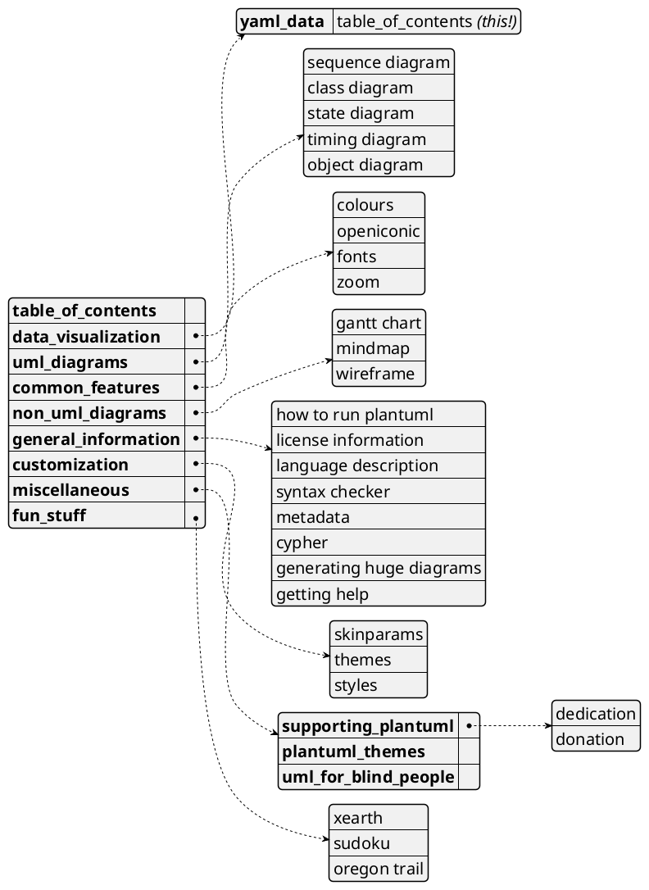

## UML Diagrams

PlantUML draws beautiful UML diagrams from simple textual descriptions. This document gives a demo of the following types of UML diagrams:

* Sequence Diagram
* Class Diagram
* State Diagram
* Timing Diagram
* Object Diagram

### Sequence Diagram

The below sequence diagram describes a workflow of a software developer working on an issue. This demo illustrates a few features:

* A few different participant types
* Encompassing participants in a box
* Autonumbering of steps
* Using divider to split a diagram into logical sections
* Grouping steps
* Delay between steps
* Different arrow types

Refer the [documentation](https://plantuml.com/sequence-diagram) for the full set of features and configuration options.

The demo also introduces the following common features:

* Specifying a title for the diagram
* Defining an object instance using the `as` keyword
* Adding hyperlinks into the diagram
* Placing notes on entities

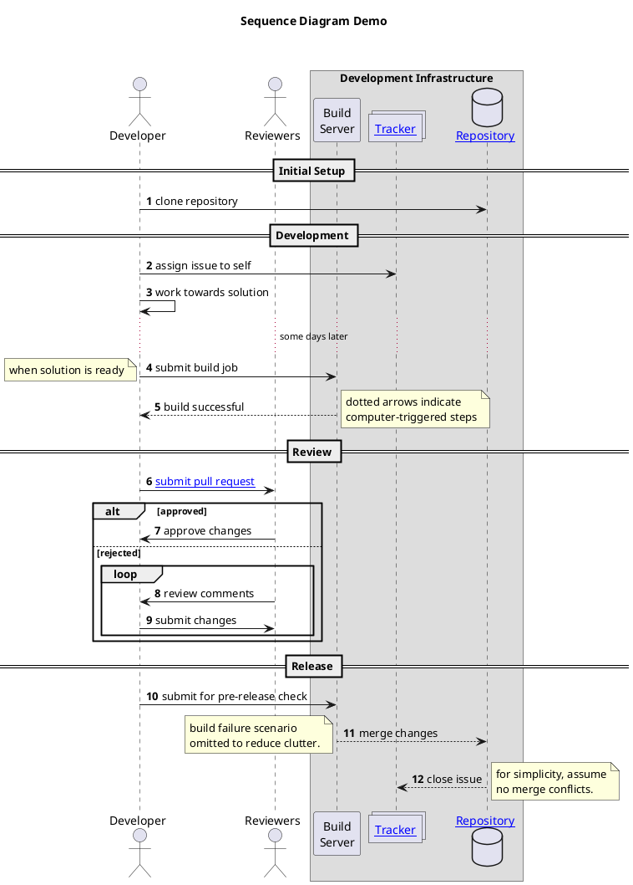

### Class Diagram

The below class diagram describes the relationships between the chess piece types. This demo illustrates a few features:

* Defining an abstract class
* Adding methods and attributes to a class
* Describing access specifiers of the class members
* Describing inheritance relationship between classes
* Hiding sections from the class

Refer the [documentation](https://plantuml.com/class-diagram) for the full set of features and configuration options.

The demo also introduces the following common features:

* The preprocessor directive `!include` to include contents of another file
* Defining a sprite and using it in the diagram
* Using unicode characters in the diagram

```plantuml
@startuml
title **Class Diagram Demo**\n\n

!include demo_src/sprites/chess_king.puml /' load sprite from file '/
!include demo_src/sprites/chess_pawn.puml
!include demo_src/sprites/chess_bishop_rook.puml  /' load file having multiple sprites '/

sprite $chess_piece_colour {  /' define sprite directly in the description '/
    FFFFFFFFFFFFFFFFFF
    F00000000FFFFFFFFF
    F00000000FFFFFFFFF
    F00000000FFFFFFFFF
    F00000000FFFFFFFFF
    F00000000FFFFFFFFF
    F00000000FFFFFFFFF
    F00000000FFFFFFFFF
    F00000000FFFFFFFFF
    FFFFFFFFFFFFFFFFFF
}

abstract class Piece {
    - rank: enum
    - file: enum
    - colour <$chess_piece_colour> : enum
    + move()
    + capture()
    # is_valid_move(starting_square, destination_square): bool
}

class "<$pawn,scale=0.4,color=Black> Pawn" as Pawn { /' include the sprite in class name '/
    - en_passant: bool
    + promote()
}

note left of Pawn::en_passant
    can this pawn
    be captured
    en passant
end note

class "<$king,scale=.4,color=green> King" as King { /' change the sprite color '/
    - in_check: bool
    + castle()
}

class "<size:40><color:red>♕</color></size> Queen" as Queen /' use unicode character in class name '/
class "<size:40>&#9816;</size> Knight" as Knight /' use unicode value in class name'/
class "<$bishop,scale=.5,color=Black> Bishop" as Bishop
class "<$rook,scale=.5,color=Black> Rook" as Rook

Piece <|-- Pawn
Piece <|-- Knight
Piece <|-- Bishop
Piece <|-- Rook
Piece <|-- King
Bishop <|-- Queen
Rook <|-- Queen

hide Queen members
@enduml
```

### State Diagram

The below state diagram describes a state transition workflow of an issue tracking systems. This demo illustrates a few features:

* Defining states and substates
* Specifying the state attribute
* Using hidden connectors to guide the diagram layout
* Specifying the state transitions

Refer the [documentation](https://plantuml.com/state-diagram) for the full set of features and configuration options.

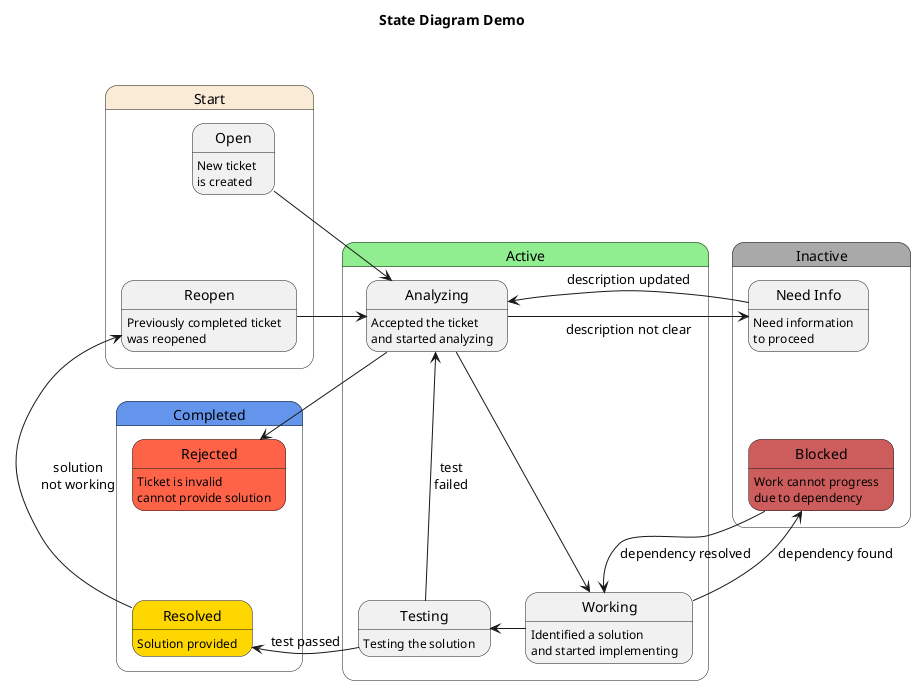
### Timing Diagram

The below timing diagram shows a hypothetical data transfer protocol. This demo illustrates a few features:

* Declaring various types of elements in a timing diagram
* Specifying transitions as either time-oriented or participant-oriented
* Displaying time constraints
* Highlighting a region of the diagram

Refer the [documentation](https://plantuml.com/timing-diagram) for the full set of features and configuration options.

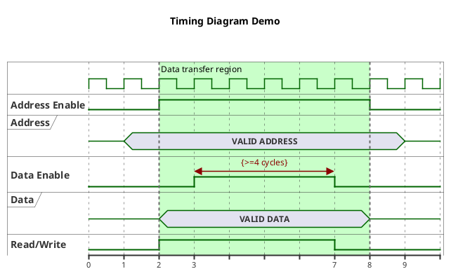
### Object Diagram

The below object diagram illustrates a common implementation of virtual functions in C++. This demo illustrates a few features:

* Declaring object type and map type
* Adding link from a map field to an object
* Specifying fields in an object
* Using divider to split a diagram into logical sections
* Specifying direction for arrow connectors
* Using hidden connectors to guide the diagram layout
* Using class diagram and object diagram together

Refer the [documentation](https://plantuml.com/object-diagram) for the full set of features and configuration options.

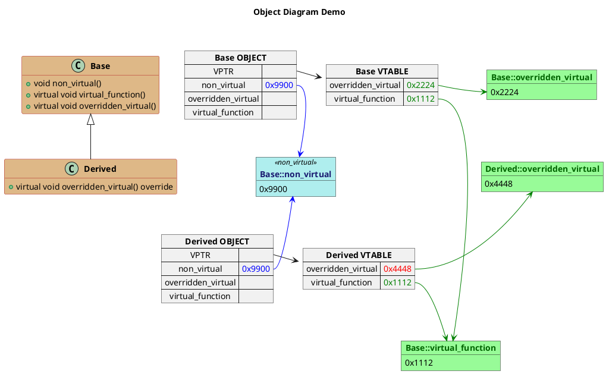
## Common Features

This section includes demo of the common features that apply to all or multiple diagram types:

* Colours
* OpenIconic
* Fonts
* Zoom

### Colours

The colour can be configured for almost all the entities that appear in PlantUML diagrams. The colour can be specified by its hexadecimal RGB value.

#### Named Colours

PlantUML also defines names for some common colours. These names can be also be used to specify the colour. The `colors` command prints the palette of all the named colours.

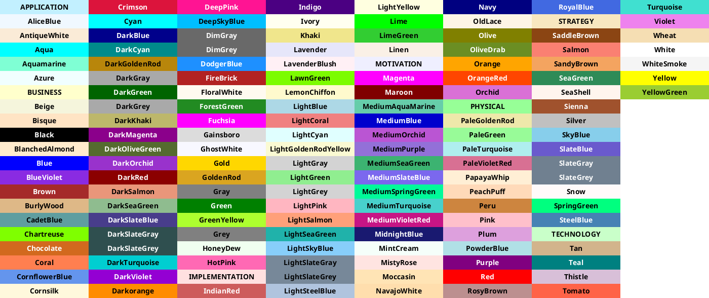

#### Similar Colours

The `colors` command can also be called with an argument, which is either a named colour or a hexadecimal RGB colour value. It prints the palette of named colours similar to the specified colour.

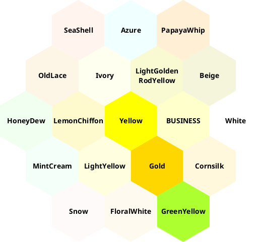

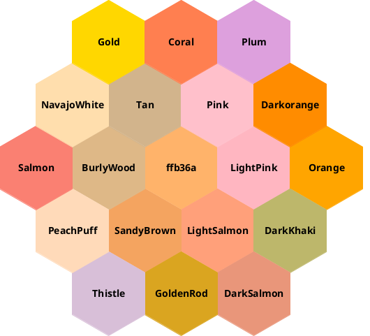

#### Demo

This demo shows the use of various colours in a sequence diagram and a class diagram.

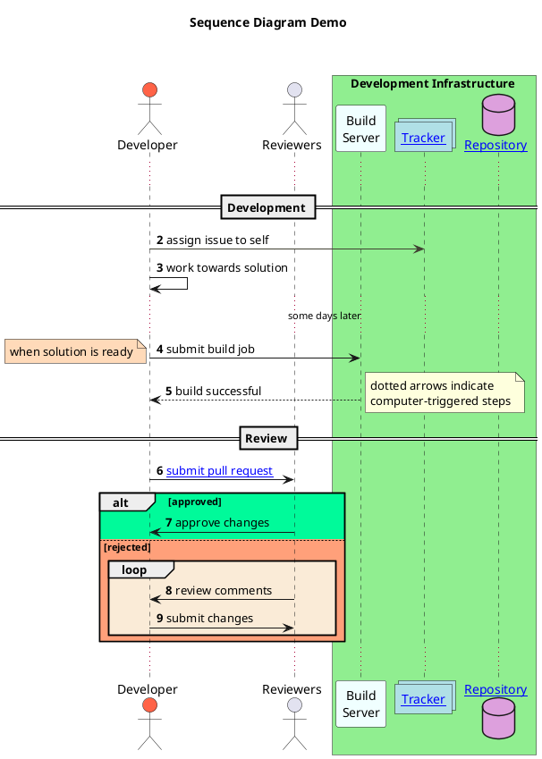

<br><br>

```plantuml
@startuml
title **Class Diagram Demo**\n\n
!include demo_src/sprites/chess_king.puml /' load sprite from file '/
!include demo_src/sprites/chess_pawn.puml
!include demo_src/sprites/chess_bishop_rook.puml  /' load file having multiple sprites '/

sprite $chess_piece_colour {  /' define sprite directly in the description '/
    FFFFFFFFFFFFFFFFFF
    F00000000FFFFFFFFF
    F00000000FFFFFFFFF
    F00000000FFFFFFFFF
    F00000000FFFFFFFFF
    F00000000FFFFFFFFF
    F00000000FFFFFFFFF
    F00000000FFFFFFFFF
    F00000000FFFFFFFFF
    FFFFFFFFFFFFFFFFFF
}

abstract class Piece #WhiteSmoke {
    - rank: enum
    - file: enum
    - colour <$chess_piece_colour> : enum
    + move()
    + capture()
    # is_valid_move(starting_square, destination_square): bool
}

class "<$pawn,scale=0.4,color=Black> Pawn" as Pawn #D0D0FF { /' include the sprite in class name '/
    - en_passant: bool
    + promote()
}

note left of Pawn::en_passant
    can this pawn
    be captured
    en passant
end note

class "<$king,scale=.4,color=green> King" as King { /' change the sprite color '/
    - in_check: bool
    + castle()
}

class "<size:40><color:red>♕</color></size> Queen" as Queen #Gold /' use unicode character in class name '/
class "<size:40>&#9816;</size> Knight" as Knight /' use unicode value in class name'/
class "<$bishop,scale=.5,color=Black> Bishop" as Bishop
class "<$rook,scale=.5,color=Black> Rook" as Rook

Piece <|-- Pawn
Piece <|-[#Green]- Knight
Piece <|-- Bishop
Piece <|-- Rook
Piece <|-[#Indigo]- King
Bishop <|-- Queen
Rook <|-- Queen

hide Queen members
@enduml
```

### OpenIconic

The open source icon set OpenIconic can be used in diagrams using the syntax `<&icon_name>`. The `listopeniconic` command lists the available icons.

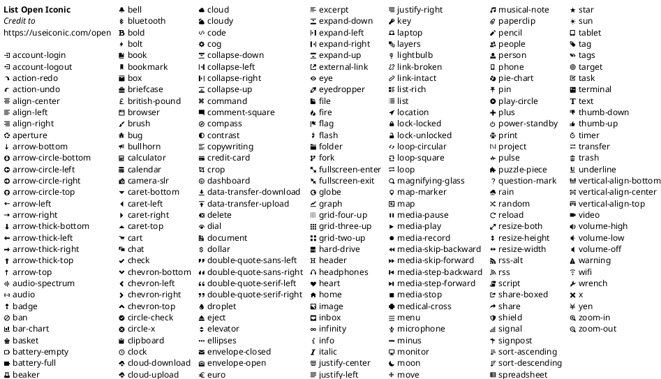

#### Demo


### Fonts

The font can be configured for almost all the text that appears in PlantUML diagrams. The `listfonts` command lists all the fonts available on the system.

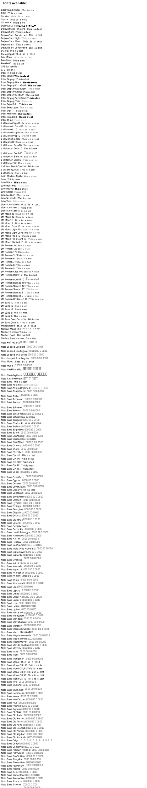

#### Demo

This demo shows the customization of font used in a sequence diagram.

The demo also introduces the following common features:

* Customizing the diagram using the `skinparam` command

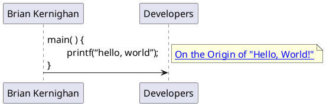

### Zoom

The generated image can be zoomed in or out by specifying a scaling factor.

This demo shows the use of `scale` command to enlarge the image.

The demo also introduces the following common features:

* PlantUML's preprocessor functionalities

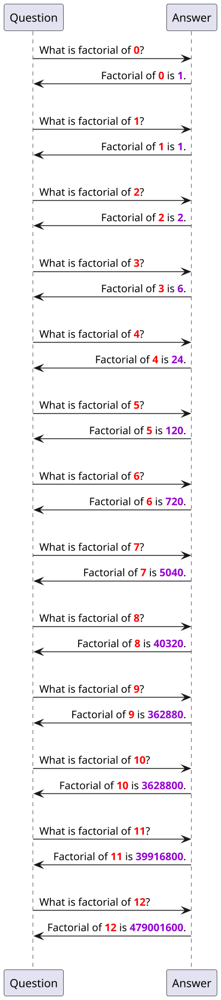

## Non-UML Diagrams

PlantUML can also draw several types of non-UML diagrams from simple textual descriptions. This document gives a demo of the following types of non-UML diagrams:

* Gantt Chart
* Mindmap
* Wireframe

### Gantt Chart

The below gantt chart illustrates the schedule of a fictional project. This demo illustrates a few features:

* Declaring tasks on the chart
* Specifying start date for task
* Specifying task duration
* Separating tasks into logical sections
* Showing milestones on the chart
* Assigning workers to tasks
* Indicating constraints between tasks or milestones

Refer the [documentation](https://plantuml.com/gantt-diagram) for the full set of features and configuration options.

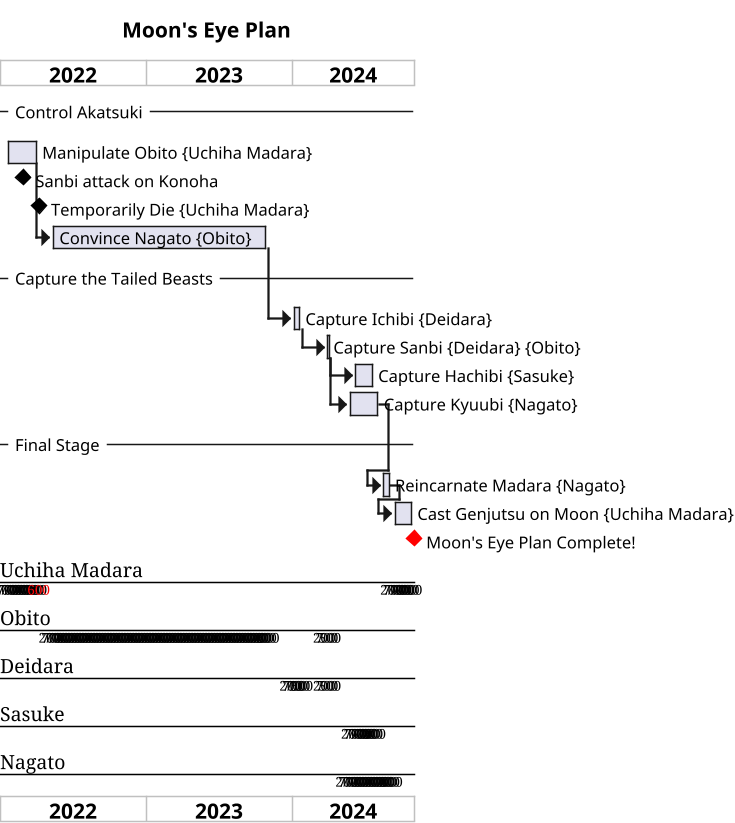

### Mindmap

The below mindmap illustrates some investment options available in India. This demo illustrates a few features:

* Adding items to the mindmap heirarchically
* Splitting the mindmap into left side and right side
* Applying styles to various parts of the diagram

Refer the [documentation](https://plantuml.com/mindmap-diagram) for the full set of features and configuration options.

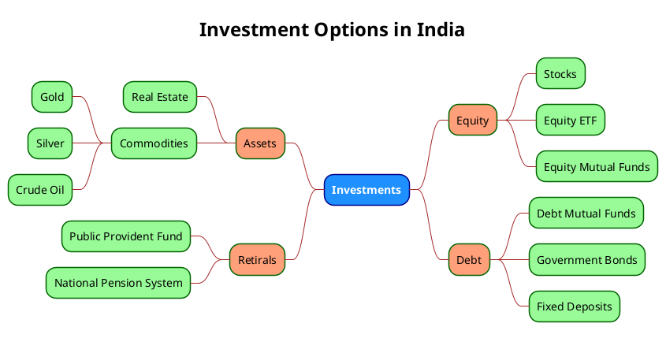

### Wireframe

The below wireframe illustrates the user interface of a social media site. This demo illustrates a few features:

* Use of a few standard UI elements, such as buttons, dropdown
* Organizing the UI elements using table
* Formatting the text elements using Creole markup

Refer the [documentation](https://plantuml.com/salt) for the full set of features and configuration options.

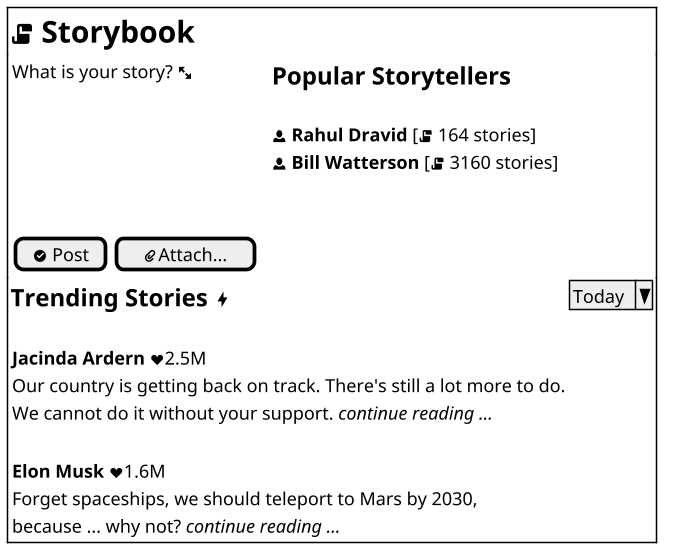

## General Information

### How to run PlantUML

There are several ways to run PlantUML. The most commonly used ways are:

* **From the command line**: Download the latest precompiled binary `plantuml.jar` from the [download page](https://plantuml.com/download). Execute it from the command line. Provide the text files or directory containing the diagram descriptions as arguments. (requires [Java](https://www.java.com/en/download/) and [Graphviz](https://graphviz.org/download/))

    ```
    java -jar plantuml.jar file1 file2 file3
    ```

    Refer the [documentation](https://plantuml.com/command-line) for the full set of features and configuration options.

* **Using the PlantUML server**: The PlantUML server hosted as a web service at http://www.plantuml.com/plantuml/ can be used to generate the diagram. A PlantUML server instance can also be hosted locally on a private server.

    Refer the [documentation](https://plantuml.com/server) for the full set of features and configuration options.

* **As a standalone GUI**: PlantUML can be run as a standalone GUI application, either by double clicking the `plantuml.jar` or using the following command:

    ```
    java -jar plantuml.jar -gui
    ```

    Then the file or directory containing the diagram descriptions can be selected from the GUI to generate the diagrams.

* **As a docker container**: PlantUML's official docker image can be downloaded with the following command:

    ```
    docker pull plantuml/plantuml-server
    ```

    It hosts the plantuml server locally on `http://localhost:8080`.

### License Information

PlantUML is licensed under the GPL license. It is also available under other licenses (LGPL, Apache, Eclipse Public, MIT) with some missing features. The generated images are owned by the author of the diagram description.

The special command `license` prints the license text.

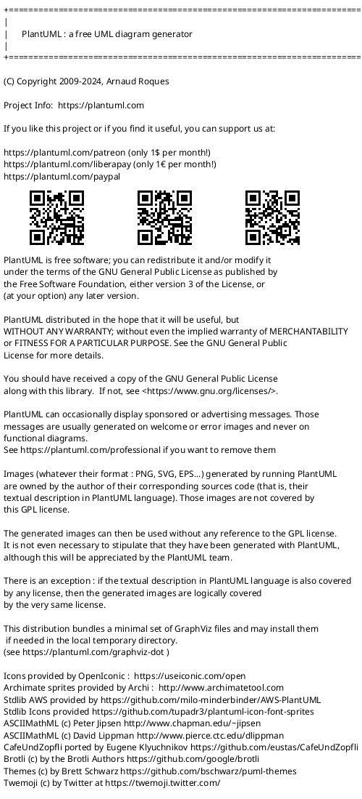

### Language Description

The command line option `-language` prints to standard output a description of the PlantUML language.

### Syntax Checker

The command line option `-syntax` checks the syntax of the diagram description from the standard input, and reports any syntax errors without generating the diagram.

### Metadata

PlantUML stores the diagram description into the generated image as metadata, in the form of encoded text. The command line option `-metadata` recovers it from the generated image.

### Cypher

The command line option `-cypher` replaces all words, except PlantUML keywords, with random letters. This is useful while reporting issues when the diagram description contains confidential data.

### Generating Huge Diagrams

PlantUML restricts image width and height to 4096 pixels by default. This can be overridden by setting the environment variable `PLANTUML_LIMIT_SIZE`.

### Getting Help

Questions not answered from the documentation can be asked either on the [PlantUML forum](https://forum.plantuml.net/) or on [PlantUML's github page](https://github.com/plantuml/plantuml/issues). PlantUML's source code is available on [github](https://github.com/plantuml).

## Customization

PlantUML provides a number of features for customizing the look and feel of the diagrams. This section provides a demo of the following customization features:

* Skinparams
* Themes
* Styles

### Skinparams

The colors and fonts of the diagram can be changed by specifying one or more `skinparam` declarations in the diagram description, with the following syntax:

```
skinparam <parameter> <value>
```

#### Demos

* **black and white diagram**: The skinparam `monochrome` is used to make a black and white diagram.

```plantuml
@startuml
skinparam monochrome true
skinparam DefaultFontName Courier New
skinparam DefaultFontSize 16
"Brian Kernighan" -> Developers : main( ) {\n        printf(“hello, world”);\n}
note right : [[https://ozanerhansha.medium.com/on-the-origin-of-hello-world-61bfe98196d5 On the Origin of "Hello, World!"]]
@enduml
```

* **handwritten diagram**: The skinparam `handwritten` is used to give a hand-drawn appearance to the diagram.

```plantuml
@startuml
skinparam handwritten true
skinparam DefaultFontName Courier New
skinparam DefaultFontSize 16
"Brian Kernighan" -> Developers : main( ) {\n        printf(“hello, world”);\n}
note right : [[https://ozanerhansha.medium.com/on-the-origin-of-hello-world-61bfe98196d5 On the Origin of "Hello, World!"]]
@enduml
```

* **dark mode diagram**: The skinparam `monochrome` set to `reverse` generates a dark mode diagram, suitable for placing the diagram on a black background.

```plantuml
@startuml
skinparam monochrome reverse
skinparam DefaultFontName Courier New
skinparam DefaultFontSize 16
"Brian Kernighan" -> Developers : main( ) {\n        printf(“hello, world”);\n}
note right : [[https://ozanerhansha.medium.com/on-the-origin-of-hello-world-61bfe98196d5 On the Origin of "Hello, World!"]]
@enduml
```

#### List of all skinparams

The command `skinparameters` can be used to generate a diagram with a list of all the available skinparams. This list can also be generated by executing PlantUML on the command line with the `-language` option.

```plantuml
skinparameters
```

### Themes

Themes can be applied to the PlantUML diagrams. The command `help themes` lists the themes available in the core library. Some themes include procedures to colour messages.

```plantuml
help themes
```

#### Demo

```plantuml
@startuml
!theme metal
title **Sequence Diagram Demo**

actor Developer as Dev
actor Reviewers

box Development Infrastructure
    participant "Build\nServer" as Build
    collections "[[https://github.com/dragondive/hebi/issues Tracker]]" as Tracker
    database "[[https://github.com/dragondive/hebi Repository]]" as Repository
end box

autonumber 2
...
== Development ==
Dev -> Tracker : assign issue to self
Dev -> Dev : work towards solution

... some days later ...
Dev -> Build : submit build job
note left : when solution is ready
Build --> Dev : $success("build successful")
note right: dotted arrows indicate\ncomputer-triggered steps

== Review ==
Dev ->  Reviewers : [[https://github.com/dragondive/hebi/compare submit pull request]]
alt approved
    Reviewers -> Dev : $success("approve changes")
else rejected
    loop
        Dev <- Reviewers : $warning("review comments")
        Dev -> Reviewers : submit changes
    end loop
end alt
...

@enduml
```

### Styles

CSS-like styles can be applied to the diagrams. The stylesheet can be either included inline in the diagram description between `<style>` and `</style>` tags, or included from a separate file.

#### Demo

```plantuml
@startuml
<style>
    classDiagram {
        class {
            BackGroundColor PowderBlue
            LineColor CornflowerBlue
        }

        arrow {
            LineColor Tomato
        }

        .major_piece {
            FontStyle bold
            BackGroundColor Yellow
        }
    }
</style>
title **Class Diagram Demo**\n\n

!include demo_src/sprites/chess_king.puml /' load sprite from file '/
!include demo_src/sprites/chess_pawn.puml
!include demo_src/sprites/chess_bishop_rook.puml  /' load file having multiple sprites '/

sprite $chess_piece_colour {  /' define sprite directly in the description '/
    FFFFFFFFFFFFFFFFFF
    F00000000FFFFFFFFF
    F00000000FFFFFFFFF
    F00000000FFFFFFFFF
    F00000000FFFFFFFFF
    F00000000FFFFFFFFF
    F00000000FFFFFFFFF
    F00000000FFFFFFFFF
    F00000000FFFFFFFFF
    FFFFFFFFFFFFFFFFFF
}

abstract class Piece {
    - rank: enum
    - file: enum
    - colour <$chess_piece_colour> : enum
    + move()
    + capture()
    # is_valid_move(starting_square, destination_square): bool
}

class "<$pawn,scale=0.4,color=Black> Pawn" as Pawn { /' include the sprite in class name '/
    - en_passant: bool
    + promote()
}

note left of Pawn::en_passant
    can this pawn
    be captured
    en passant
end note

class "<$king,scale=.4,color=green> King" as King { /' change the sprite color '/
    - in_check: bool
    + castle()
}

class "<size:40><color:red>♕</color></size> Queen" as Queen <<major_piece>> /' use unicode character in class name '/
class "<size:40>&#9816;</size> Knight" as Knight /' use unicode value in class name'/
class "<$bishop,scale=.5,color=Black> Bishop" as Bishop
class "<$rook,scale=.5,color=Black> Rook" as Rook <<major_piece>>

Piece <|-- Pawn
Piece <|-- Knight
Piece <|-- Bishop
Piece <|-- Rook
Piece <|-- King
Bishop <|-- Queen
Rook <|-- Queen

hide Queen members
@enduml
```

## Miscellaneous

### Supporting PlantUML

There are a number of options available to support the PlantUML tool:

* Dedication
* Donation

#### Dedication

Dedicate a picture or a photo with a message, which will be integrated into the PlantUML code. To support this service, a contribution of $5 per month is recommended.

The dedication can be public or private. It will be available in each and every deployed instance of PlantUML across the world!

```plantuml
@startuml
Write your own dedication!
@enduml
```

The currently added public dedications can be seen directly from the source code: https://github.com/plantuml/plantuml/blob/master/src/net/sourceforge/plantuml/dedication/Dedications.java

#### Donation

To support PlantUML via crowdfunding, donate using [Paypal](http://plantuml.com/paypal), [Patreon](http://plantuml.com/patreon) or [Liberapay](http://plantuml.com/lp). The special `donors` command prints the list of donors and sponsors.

### PlantUML Themes

Some user-contributed PlantUML themes are available at [Puml Themes](https://bschwarz.github.io/puml-themes/) and [RedDress-PlantUML](https://github.com/Drakemor/RedDress-PlantUML)

### UML for Blind People

[This web page](http://www.bfg-it.de/wiki/Blind_mit_UML_arbeiten) describes PlantUML as part of a solution to describe UML to blind people. (The page is written in German, and can be translated to English or other languages using a language translation engine.)


## Fun Stuff

PlantUML comes with some fun stuff. This document gives a demo of the following fun stuff:

* xearth
* sudoku
* oregon trail

### xearth

This demo shows the use of `xearth` command to draw a map of the Earth focussed on a specified coordinate.

Refer the [documentation](https://plantuml.com/xearth) for the full set of features and configuration options.

```plantuml
@startuml
xearth(800,800)     /' define the image dimensions for the earth image. '/
viewPositionType = Fixed
viewPosLat = 12.971563711294497    /' ಬ್ರಿಗೇಡ್ ರಸ್ತೆ, '/
viewPosLong = 77.60679643358596    /' ಬೆಂಗಳೂರು, ಭಾರತ '/
12.971563711294497 77.60679643358596   "Brigade Road, Bengaluru, India"
shadeP = false  /' if true, the Earth's surface is shaded based on its current position relative to the Sun. '/
gridP = true
gridDivision = 30
@enduml
```

### sudoku

This demo shows the use of `sudoku` command to generate a randomized sudoku puzzle.

```plantuml
@startuml
sudoku
@enduml
```

The `sudoku` command can also be called with an argument, which is the seed to generate a specific sudoku puzzle.

```plantuml
@startuml
sudoku 4nk3o5djfhu
@enduml
```

### oregon trail

This demo shows the text-based adventure game "Oregon Trail".

```plantuml
@startuml
run oregon trail
@enduml
```
