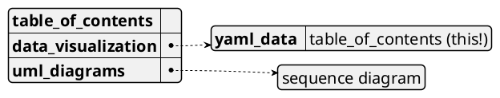
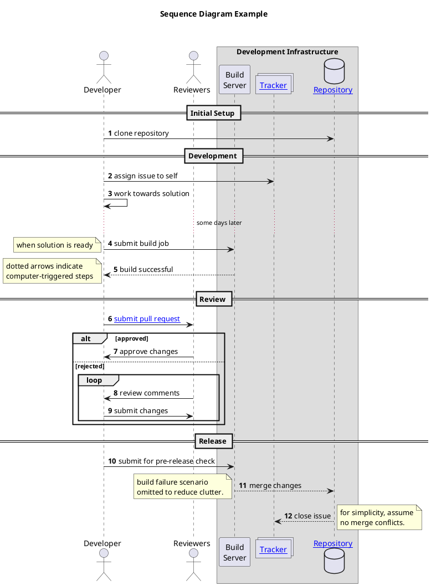

# PlantUML demo ... and other useful stuff

## Data Visualization

PlantUML can _also_ be used to visualize data written in various data representation formats. This document gives a demo of visualization for the following formats:
* YAML: YAML Ain't Markup Language

### YAML Data Visualization

The below demo has the table of contents of this document written in YAML. To create a visual representation with PlantUML, enclose the YAML data within `@startyaml` and `@endyaml`. This YAML data visualization is one of the PlantUML demos, making it an example of self-reference. :grin:

_Note_: PlantUML's YAML support is limited. It doesn't recognize several valid YAML constructs. For example, it considers [YAML's homepage](https://yaml.org/), written in YAML, as invalid YAML.

Refer the [documentation](https://plantuml.com/yaml) for the full set of features and configuration options.

The example also introduces the following features:
* Writing comments in the plantuml description using `/' '/`

## UML Diagrams

PlantUML draws beautiful UML diagrams from simple textual descriptions. This document gives a demo of the following types of UML diagrams:
* Sequence Diagram

### Sequence Diagram

The below sequence diagram describes a workflow of a software developer working on an issue. This illustrates a few features:
* A few different participant types
* Encompassing participants in a box
* Autonumbering of steps
* Using divider to split a diagram into logical sections
* Grouping steps
* Delay between steps
* Label on steps
* Different arrow types

Refer the [documentation](https://plantuml.com/sequence-diagram) for the full set of features and configuration options.

The example also introduces the following features:
* The `as` keyword to define an object alias
* Adding hyperlinks into the diagram

