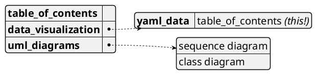

# PlantUML demo ... and other useful stuff

## Data Visualization

PlantUML can _also_ be used to visualize data written in various data representation formats. This document gives a demo of visualization for the following formats:

* YAML: YAML Ain't Markup Language

### YAML Data Visualization

The below demo has the table of contents of this document written in YAML. To create a visual representation with PlantUML, enclose the YAML data within `@startyaml` and `@endyaml`. This YAML data visualization is one of the PlantUML demos, making it an example of self-reference. :grin:

_Note_: PlantUML's YAML support is limited. It doesn't recognize several valid YAML constructs. For example, it considers [YAML's homepage](https://yaml.org/), written in YAML, as invalid YAML.

Refer the [documentation](https://plantuml.com/yaml) for the full set of features and configuration options.

The demo also introduces the following common features:

* Customizing the diagram using `<style>`
* Single line comment using `'`
    * Should be placed on its own separate line, otherwise it is parsed as continuation of the preceding text (unlike `//` comments of C, C++, and Java)
* Multiline comment using `/' ... '/`
    * Can be used anywhere, including on a line having the diagram description
* Use of the lightweight markup language creole



## UML Diagrams

PlantUML draws beautiful UML diagrams from simple textual descriptions. This document gives a demo of the following types of UML diagrams:

* Sequence Diagram
* Class Diagram

### Sequence Diagram

The below sequence diagram describes a workflow of a software developer working on an issue. This demo illustrates a few features:

* A few different participant types
* Encompassing participants in a box
* Autonumbering of steps
* Using divider to split a diagram into logical sections
* Grouping steps
* Delay between steps
* Different arrow types

Refer the [documentation](https://plantuml.com/sequence-diagram) for the full set of features and configuration options.

The demo also introduces the following common features:

* Specifying a title for the diagram
* Defining an object instance using the `as` keyword
* Adding hyperlinks into the diagram
* Placing notes on entities


### Class Diagram

The below class diagram describes the relationships between the chess piece types. This demo illustrates a few features:

* Defining an abstract class
* Adding methods and attributes to a class
* Describing access specifiers of the class members
* Describing inheritance relationship between classes
* Hiding sections from the class

Refer the [documentation](https://plantuml.com/class-diagram) for the full set of features and configuration options.

The demo also introduces the following common features:

* The preprocessor directive `!include` to include contents of another file
* Defining a sprite and using it in the diagram
* Using unicode characters in the diagram

```plantuml
@startuml
title **Class Diagram Demo**\n\n

!include sprites/chess_king.puml /' load sprite from file '/
!include sprites/chess_pawn.puml
!include sprites/chess_bishop_rook.puml  /' load file having multiple sprites '/

sprite $chess_piece_colour {  /' define sprite directly in the description '/
    FFFFFFFFFFFFFFFFFF
    F00000000FFFFFFFFF
    F00000000FFFFFFFFF
    F00000000FFFFFFFFF
    F00000000FFFFFFFFF
    F00000000FFFFFFFFF
    F00000000FFFFFFFFF
    F00000000FFFFFFFFF
    F00000000FFFFFFFFF
    FFFFFFFFFFFFFFFFFF
}

abstract class Piece {
    - rank: enum
    - file: enum
    - colour <$chess_piece_colour> : enum
    + move()
    + capture()
    # is_valid_move(starting_square, destination_square): bool
}

class "<$pawn,scale=0.4,color=Black> Pawn" as Pawn { /' include the sprite in class name '/
    - en_passant: bool
    + promote()
}

note left of Pawn::en_passant
    can this pawn
    be captured
    en passant
end note

class "<$king,scale=.4,color=green> King" as King { /' change the sprite color '/
    - in_check: bool
    + castle()
}

class "<size:40><color:red>♕</color></size> Queen" as Queen /' use unicode character in class name '/
class "<size:40>&#9816;</size> Knight" as Knight /' use unicode value in class name'/
class "<$bishop,scale=.5,color=Black> Bishop" as Bishop
class "<$rook,scale=.5,color=Black> Rook" as Rook

Piece <|-- Pawn
Piece <|-- Knight
Piece <|-- Bishop
Piece <|-- Rook
Piece <|-- King
Bishop <|-- Queen
Rook <|-- Queen

hide Queen members
@enduml
```
