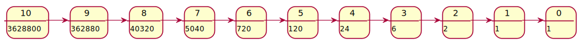
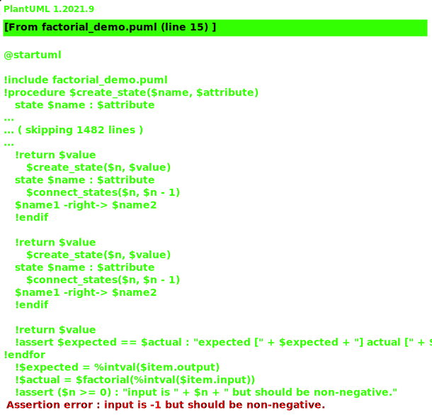

# Fun and learning with the PlantUML preprocessor

The PlantUML preprocessor provides a higher level abstraction to generate the diagram
descriptions. It can also be used as a programming language to _compute_ the diagrams!

The preprocessor provides variables, conditional expressions, looping constructs, and
even functions, making it a full fledged Turing complete language.

This also enables having some fun while learning the preprocessor features. In this
document, I describe some such examples. **All of them are my original work.**

The example diagrams shown here are _computed_ by PlantUML, not manually described in
puml files.

1. **Compute factorial of a number**: uses and draws the recursion!

   This _hacks_ a state diagram to denote the recursive calls and the computed
   factorial value for each number. The `!function` feature defines the factorial
   function that computes the factorial, creates the states and draws the connections
   between the states.

   https://github.com/dragondive/plantuml_demo/blob/bfd3b1c018fe5893a8f37a9a01a6d9e0074be6eb/src/preprocessor/factorial_demo.puml#L1-L31

   

2. **"Unit tests" for the factorial function**

   This _hacks_ the preprocessor's JSON parsing utility and `!assert` macro to run
   "unit tests" for the factorial function. For an invalid input, that is a negative
   number, the factorial function raises an assert. However, there is no facility to
   expect an assertion or exception (which is fair as the preprocessor is not a unit
   testing framework). The "failed" unit test appears as an assertion error in the
   generated diagram.

   https://github.com/dragondive/plantuml_demo/blob/3166a462a51904b0d822291bd61657bcb1650376/src/preprocessor/factorial_demo_test.puml#L1-L32

   
