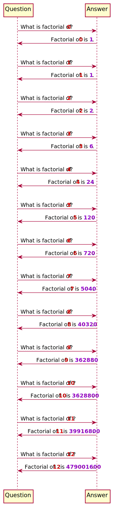
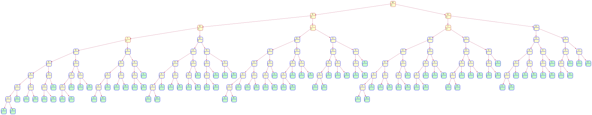

# Fun and learning with the PlantUML preprocessor

The PlantUML preprocessor provides a higher level abstraction to generate the diagram
descriptions. It can also be used as a programming language to _compute_ the diagrams!

The preprocessor provides variables, conditional expressions, looping constructs, and
even functions, making it a full fledged Turing complete language.

This also enables having some fun while learning the preprocessor features. In this
document, I describe some such examples. **All of them are my original work.**

The example diagrams shown here are _computed_ by PlantUML, not manually described in
puml files.

> :bulb: **TIP**
>
> Some diagrams shown below are too big to be easily readable from the webpage. You may
> use your browser's facility to open them in a new window/tab for better clarity.

1. **Compute factorial of a number**: uses and draws the recursion!

   This _hacks_ a state diagram to denote the recursive calls and the computed
   factorial value for each number. The `!function` feature defines the factorial
   function that computes the factorial, creates the states and draws the connections
   between the states.

   https://github.com/dragondive/plantuml_demo/blob/bfd3b1c018fe5893a8f37a9a01a6d9e0074be6eb/src/preprocessor/factorial_demo.puml#L1-L31

   

2. **"Unit tests" for the factorial function**

   This _hacks_ the preprocessor's JSON parsing utility and `!assert` macro to run
   "unit tests" for the factorial function. For an invalid input, that is a negative
   number, the factorial function raises an assert. However, there is no facility to
   expect an assertion or exception (which is fair as the preprocessor is not a unit
   testing framework). The "failed" unit test appears as an assertion error in the
   generated diagram.

   https://github.com/dragondive/plantuml_demo/blob/3166a462a51904b0d822291bd61657bcb1650376/src/preprocessor/factorial_demo_test.puml#L1-L32

   

3. **Compute factorial for a sequence of numbers**:

   The factorial function is now memoized to reuse the computed factorial value for a
   number. As the preprocessor does not provide any array or hashmap data structure,
   string concatenation is _hacked_ to create a hashmap (dictionary).

   https://github.com/dragondive/plantuml_demo/blob/caa5d1bb507f01448a85e9fd16860f3af0e73780/src/preprocessor/factorial_question_answer_sequence.puml#L1-L42

   

4. **Compute fibonacci series and draw the recursion tree** (out-in computation)

   The state diagram is once again _hacked_ to draw a fibonacci recursion tree. This
   diagram is more complicated to compute than the factorial recursion because:

   1. Each non-leaf node connects to two other nodes.
   2. There are multiple instances of leaf node and non-leaf nodes in the tree, so a
      mechanism is needed to identify each such instance.
   3. As there are multiple leaf nodes, the end of recursion needs to be computed
      carefully to prevent an accidental endless recursion.

   I called this computation _out-in_ because it primarily focusses on drawing the tree,
   while computing and filling in the fibonacci series numbers along the way.

   I created this approach in my early days of learning when I was less well-versed with
   using the preprocessor for recursion. I created the more intuitive _in-out_ approach
   shortly afterwards.

   https://github.com/dragondive/plantuml_demo/blob/536fc83590d02723a864357afabf5fa121188950/src/preprocessor/fibonacci_recursive_out_in_demo.puml#L1-L53

   

5. **Compute fibonacci series and draw the recursion tree** (in-out computation)

   This also _hacks_ the state diagram to draw the Fibonacci recursion tree. However,
   it uses an _in-out_ computation, where the primary focus is on computing the
   Fibonacci series numbers, then drawing the nodes (states) around them and connecting
   them to form the tree.

   This code is more intuitive for a human reader as it looks similar to the naive
   recursive Fibonacci implementation in conventional programming languages.

   https://github.com/dragondive/plantuml_demo/blob/536fc83590d02723a864357afabf5fa121188950/src/preprocessor/fibonacci_recursive_in_out_demo.puml#L1-L44

   

6. **Customizing generated diagram with user-defined function and lambda function**

   PlantUML preprocessor has first class functions and even lambda functions! This is
   unexpectedly remarkable for what was not even intended to be a programming language.

   I customized the node (state) and the value formatting by passing in a user-defined
   function and a lambda expression. These are respectively used to draw the leaf nodes
   with a different background colour, and a different border style for nodes having
   values up to 10.

   https://github.com/dragondive/plantuml_demo/blob/536fc83590d02723a864357afabf5fa121188950/src/preprocessor/fibonacci_recursive_in_out_with_user_function_demo.puml#L1-L62

   
