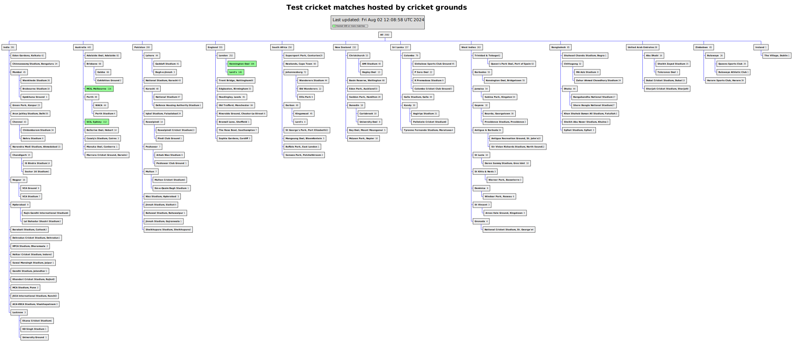
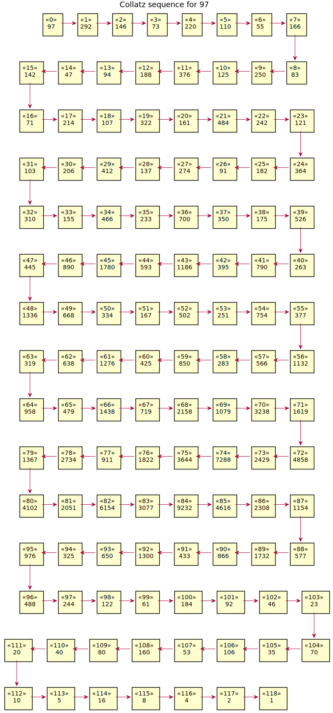

Fun and learning with the PlantUML preprocessor
===============================================

The PlantUML preprocessor provides a higher level abstraction to generate the diagram
descriptions. It can also be used as a programming language to *compute* the diagrams!
The preprocessor provides variables, conditional expressions, looping constructs, and
functions, among other facilities. The programs can also take external input through
a file.

This also enables having some fun while learning the preprocessor features. In this
document, I describe some such examples. These example diagrams are *computed* by
PlantUML, not manually described.

**All of them are my original work.**

   \:bulb: **TIP**

   Some diagrams below are too large to view easily on the webpage. You can open them in
   a new tab/window or download them for better clarity. The images are in SVG format,
   allowing you to zoom in for a clearer view.

.. contents:: **Table of Contents**

Factorial function computation and drawings
-------------------------------------------

Recursive computation of factorial
~~~~~~~~~~~~~~~~~~~~~~~~~~~~~~~~~~

This *hacks* a state diagram to denote the recursive calls and the computed factorial
value for each number. The ``!function`` feature defines the factorial function that
computes the factorial, creates the states and draws the connections between the states.
The preprocessor not only computes but also draws the recursion!

https://github.com/dragondive/plantuml_demo/blob/bfd3b1c018fe5893a8f37a9a01a6d9e0074be6eb/src/preprocessor/factorial_demo.puml#L1-L31

.. image:: diagrams/factorial_demo.svg
   :alt: State Diagram hack showing factorial computation

"Unit tests" for the factorial function
~~~~~~~~~~~~~~~~~~~~~~~~~~~~~~~~~~~~~~~

This *hacks* the preprocessor's JSON parsing utility and ``!assert`` directive to run
"unit tests" for the factorial function. For an invalid input, that is a negative
number, the factorial function raises an assert. However, there is no facility to expect
an assertion or exception (which is fair as the preprocessor is not a unit testing
framework). The "failed" unit test appears as an assertion error in the
generated diagram.

https://github.com/dragondive/plantuml_demo/blob/3166a462a51904b0d822291bd61657bcb1650376/src/preprocessor/factorial_demo_test.puml#L1-L32

.. image:: diagrams/factorial_demo_test.svg
   :alt: Hack showing unit testing of factorial function

Compute factorial for a sequence of numbers
~~~~~~~~~~~~~~~~~~~~~~~~~~~~~~~~~~~~~~~~~~~

The factorial function is now memoized to reuse the computed factorial value for a
number. As the preprocessor does not provide any array or hashmap data structure,
string concatenation is *hacked* to create a hashmap (dictionary).

https://github.com/dragondive/plantuml_demo/blob/caa5d1bb507f01448a85e9fd16860f3af0e73780/src/preprocessor/factorial_question_answer_sequence.puml#L1-L42

.. image:: diagrams/factorial_question_answer_sequence.svg
   :alt: Compute factorial for a sequence of numbers

Fibonacci series computation and drawings
-----------------------------------------

Recursive computation and out-in drawing
~~~~~~~~~~~~~~~~~~~~~~~~~~~~~~~~~~~~~~~~

The state diagram is once again *hacked* to draw a fibonacci recursion tree. This
diagram is more complicated to compute than the factorial recursion because:

1. Each non-leaf node connects to two other nodes.
2. There are multiple instances of leaf node and non-leaf nodes in the tree, so a
   mechanism is needed to identify each such instance.
3. As there are multiple leaf nodes, the end of recursion needs to be computed
   carefully to prevent an accidental endless recursion.

I called this computation *out-in* because it primarily focusses on drawing the tree,
while computing and filling in the fibonacci series numbers along the way.

I created this approach in my early days of learning when I was less well-versed with
using the preprocessor for recursion. I created the more intuitive *in-out* approach
shortly afterwards.

https://github.com/dragondive/plantuml_demo/blob/536fc83590d02723a864357afabf5fa121188950/src/preprocessor/fibonacci_recursive_out_in_demo.puml#L1-L53

Recursive computation and in-out drawing
~~~~~~~~~~~~~~~~~~~~~~~~~~~~~~~~~~~~~~~~

This also *hacks* the state diagram to draw the fibonacci recursion tree. However, it
uses an *in-out* computation, where the primary focus is on computing the fibonacci
series numbers, then drawing the nodes (states) around them and connecting them to form
the tree.

This code is more intuitive for a human reader as it looks similar to the naive
recursive Fibonacci implementation in conventional programming languages.

https://github.com/dragondive/plantuml_demo/blob/536fc83590d02723a864357afabf5fa121188950/src/preprocessor/fibonacci_recursive_in_out_demo.puml#L1-L44

Memoized computation
~~~~~~~~~~~~~~~~~~~~

The fibonacci computation is memoized using a hack similar to the one used for the
factorial function, and the drawing illustrates the memoized computation. The drawings
of the recursive and the memoized approach can be a useful visualization to demonstrate
how memoization cuts off the recursive calls.

Generate a full binary tree
~~~~~~~~~~~~~~~~~~~~~~~~~~~

This was an intermediate diagram computation I created while trying to solve the
fibonacci recursion tree diagram computation described above.

https://github.com/dragondive/plantuml_demo/blob/bb16912a54baa4188ae5ebfcffe77acb2cb0bc27/src/preprocessor/full_binary_tree_demo.puml#L1-L24

Customizing generated diagram with user-defined function and lambda function
----------------------------------------------------------------------------

PlantUML preprocessor has first class functions and even lambda functions! This is
unexpectedly remarkable for what was not even intended to be a programming language.

I customized the node (state) and the value formatting by passing in a user-defined
function and a lambda expression. These are respectively used to draw the leaf nodes
with a different background colour, and a different border style for nodes having
values up to 10.

https://github.com/dragondive/plantuml_demo/blob/536fc83590d02723a864357afabf5fa121188950/src/preprocessor/fibonacci_recursive_in_out_with_user_function_demo.puml#L1-L62

.. image:: diagrams/fibonacci_recursive_in_out_with_user_function_demo.svg
   :alt: User-defined function and lambda function

Compute and draw Test cricket matches hosting data in hierarchical structure
----------------------------------------------------------------------------

This *hacks* the Work Breakdown Structure (WBS) diagram to represent Test cricket
matches hosting data in a hierarchical structure. The JSON data file contains the
following information:

1. Number of matches played at various cricket grounds.
2. Hierarchical structure of the location (city, country) the cricket ground belongs to.

The WBS diagram represents the hierarchy as a tree to any depth, while also adding up
the count at every level beneath it. This naturally resembles the
`Composite design pattern <https://refactoring.guru/design-patterns/composite>`__, and
the computation follows such a recursive structure.

In addition, the grounds that have hosted 100 or more matches are highlighted.

https://github.com/dragondive/plantuml_demo/blob/cba7f530562a3fbf7c8bd4315af51a57302f4ea5/src/preprocessor/test_match_host_wbs_demo.puml#L1-L100

https://github.com/dragondive/plantuml_demo/blob/cba7f530562a3fbf7c8bd4315af51a57302f4ea5/src/preprocessor/test_cricket_matches_data.puml#L1-L218

Compute and draw Collatz sequence for a range of numbers
--------------------------------------------------------

This diagram computation draws the
`Collatz sequence <https://en.wikipedia.org/wiki/Collatz_conjecture>`__ using rectangle
objects. Multiple separate diagrams are drawn for the positive integers up to 100.

At the time of this writing, the preprocessor does not support modulo division, so I
used my primary school (class 1) definition of even number (numbers ending in
digits 0, 2, 4, 6, 8) :smile_cat:. I also used this hack to wrap the chain like a
snake :snake: for both readability and aesthetics. This overrides the default PlantUML
behaviour of connecting the rectangles in a straight line, which can be tiring to read
for some long chains.

The Collatz sequence chains are shown only for a few selected numbers below. The
complete set of chains is available in the directory
`diagrams <https://github.com/dragondive/plantuml_demo/tree/63b36f833afd6c53edd86806516bd93fca0cb834/src/preprocessor/diagrams>`__.

https://github.com/dragondive/plantuml_demo/blob/63b36f833afd6c53edd86806516bd93fca0cb834/src/preprocessor/collatz_sequence.puml#L1-L127

|Collatz sequence for 9| |Collatz sequence for 43| |Collatz sequence for
97|

Generate multiple customized diagrams from diagram template
-----------------------------------------------------------

A diagram template defines the overall structure with some customizable portions.
A JSON file is read to configure those customizable portions to generate multiple
diagram instances.

The below demo shows three diagrams being generated for each customer. The customer data
specified in JSON format is used to customize the diagrams. Both values and objects
appearing in the diagram can be customized.

   \:bangbang: **MISSING FEATURE/BUG**

   In the sequence diagrams, the actors not involved on the current page also appear,
   which is usually not the desired behaviour. This is due to a missing feature/bug in
   PlantUML reported on the PlantUML forum
   `here <https://forum.plantuml.net/14773/how-to-hide-participants-not-on-current-page>`__.

https://github.com/dragondive/plantuml_demo/blob/c8847caa8d8eb803960590141ba1c58f26cba7ae/src/preprocessor/multiple_diagrams_generation_demo.puml#L1-L54

**Diagrams generated for non-premium customer Initech**

|Developer Workflow for non-premium customer Initech|
|Tester Workflow for non-premium customer Initech|
|Integrator Workflow for non-premium customer Initech|

**Diagrams generated for premium customer Acme**

|Developer Workflow for premium customer Acme|
|Tester Workflow for premium customer Acme|
|Integrator Workflow for premium customer Acme|

.. |Developer Workflow for non-premium customer Initech| image:: diagrams/multiple_diagrams_generation_demo_001.svg

.. |Collatz sequence for 43| image:: diagrams/collatz_sequence_043.svg

